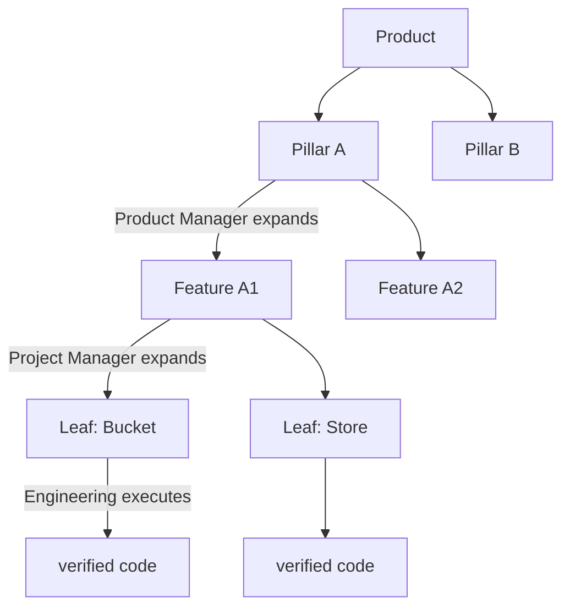

# NEXT — Product Tree, Made Observable and Enforced

Technical specification for Autodev, derived from the design conversation.

Autodev is its own runtime. The **role loop** and the light dashboard were liked
while running an ad-hoc version of them on another project; that project is
**origin/inspiration only — no shared code, no dependency, nothing ported.**

This spec adds a **UI-enumeration + observability + enforcement layer** on top of
the working execution runtime (worktrees, tmux, hooks). It does **not** rewrite
how execution works. Descriptor bump: `2 → 3`.

---

## 0. Ethos (decided)

1. **Data is the source of truth; Markdown/prose is a projection, never scraped.**
   The old failure mode was making `.md` the truth and regexing intent back out.
   Here, state is schema-validated JSON; human-readable views are rendered *from*
   it.
2. **The product is a tree; each role owns exactly one level.**
   `Product → Pillar (Product Manager) → Feature (Project Manager) → Leaf
   (Engineering)`. The loop **is** that tree being expanded then executed.
3. **Enumerate at the Feature grain.** One small `feature.json` per feature —
   Pillar level is too coarse (imports noise), a monolith is a merge hotspot.
   Feature files **link out** to leaf files; leaves and live run-state are loaded
   only on drill-down.
4. **Derive, don't store, what can drift.** Phase, "what's active," tokens are
   computed from `(tree ⋈ trace)`, not hand-maintained fields.
5. **Agents mutate typed state through contracts, never by hand-editing prose.**
   Structured output the runtime validates and applies (same rationale as
   hook-emitted traces): the model reasons freely, the *commit* is typed.
6. **Split durable intent (git-reviewed) from live execution state (`AUTODEV_HOME`).**
7. **The tree is the human control plane** — approve/reprioritize the tree, don't
   babysit transcripts.

---

## 1. Goal

- **Macro:** the loop = expand+execute the product tree.
  `Orchestrator → Product Manager (Pillar→Features) → Project Manager
  (Feature→Leaves) → Engineering (Leaf→verified code) → reconcile up`. Nodes run
  concurrently, each at its own phase — no single global phase.
- **Micro:** each role's pass is a tightly-scoped DAG — PM=research fan-in,
  Engineering=contract-first build, PjM=reconcile.
- **Observability:** every pass emits an append-only trace; the dashboard, built
  deterministically from `feature.json`, folds it into a per-agent DAG on demand.
- **Enforcement:** each role's law is placed where compaction can't erase it, and
  violating tool calls are blocked.

---

## 2. Current state (autodev repo)

```
autodev.toml ─> config.load_project ─> ProjectConfig
   operator ─CLI─> operations.ensure_agents
        ├─ workspaces.ensure_workspace   git worktree + sparse checkout + branch
        ├─ sessions.start_session        tmux runs claude/codex
        └─ prompts.render_goal ─────────> tmux send-keys (one-shot standing goal)
   UI: service.py polls /api/project every 5s → flat agent table (dark)
```

Enforced today: write-ownership + visibility (sparse checkout), merge gate.
Absent today: product tree, roles, the loop, per-role workflow shapes, charter,
trace/DAG, durable behavior across compaction. All are new here.

**Invariant:** Autodev adds exactly one file to a managed repo (`autodev.toml`);
generated runtime state lives under `AUTODEV_HOME`. The product tree (below) is
project intent authored by the role agents inside their write-roots — not
Autodev-generated scaffolding — so the invariant holds.

---

## 3. The product tree & the loop

Each role owns one level; the loop is expansion then execution of the tree.



- **Product Manager owns a Pillar** → research (fan-in) → emits the Pillar's
  **Features**.
- **Project Manager owns a Feature** → reconcile/decompose → emits the Feature's
  **Leaves** + dependency edges.
- **Engineering pod owns a Leaf** → contract-first TDD → verified code.
- **Orchestrator** schedules role-instances across the tree with concurrency
  limits; it never implements.

Each node is an independent role-instance, so many run at once at different depths
— **"not everything is in the same phase" is structural, not special-cased.** A
node's phase is **derived** from its own pass state + its subtree's progress,
joined with the live trace — never a hand-set field.

```
Pillar-A [PM done] → Feature-A1 [Eng: 2 leaves running] · Feature-A2 [PjM: splitting]
Pillar-B [PM active: researching]      Pillar-C [shipped]
```

---

## 4. Deterministic enumeration (how the UI knows what's happening)

The UI is **built by walking JSON**, never by scraping Markdown or tmux panes.

```
repo (durable intent, git-reviewed, ownership-scoped)
  product/
    pillars/<pillar>/features/<feature>/feature.json     ← UI enumerates THESE (one glob)
      └─ leaves/<leaf>/leaf.json                          ← followed on drill-down only

AUTODEV_HOME (live, folded from events)
  runs/<run>/events.jsonl   →  phase, active node, tokens, current tool

UI build = glob feature.json → group by pillar → phase+loop from file
           (live sub-state joined via run_ref → trace) ; drill = leaves[].ref, run_ref
```

**`feature.json`** — the enumeration unit (small, feature-grained):
```json
{
  "id": "certified-l3-book",
  "pillar": "replay-engine",
  "name": "Certified L3 book",
  "phase": "engineering",
  "owner_role": "engineering",
  "loop": [
    {"role": "product-manager", "s": "done"},
    {"role": "project-manager", "s": "done"},
    {"role": "engineering",     "s": "active"}
  ],
  "run_ref": "runs/2026-08-24-book-7",
  "leaves": [
    {"ref": "leaves/bucket/leaf.json", "id": "bucket"},
    {"ref": "leaves/store/leaf.json",  "id": "store"},
    {"ref": "leaves/mw/leaf.json",     "id": "mw"}
  ]
}
```

**`leaf.json`** — followed on drill-down (not during enumeration):
```json
{ "id": "store", "feature": "certified-l3-book", "status": "in_progress",
  "pod": "book", "contract_ref": "contracts/rate_limit.pyi",
  "depends_on": ["bucket"], "run_ref": "runs/2026-08-24-book-7" }
```

Design consequences:
- **Feature grain = right altitude.** Enumerating is one cheap glob of small
  files; Pillar-level blobs would bury detail and a single `project.json` would be
  a merge hotspot. Leaves are linked, not inlined.
- **Phase is joined, not stored twice.** `feature.json.phase` is coarse; live
  sub-state (which node is running, tokens) comes from `run_ref → trace`.
- **"Inbox" is not prose.** A cross-node request is a typed `depends_on` edge with
  an unmet target; the UI shows unmet edges. No `inbox/*.md` to parse.
- **Schema-validated on write** (fail-fast, like `config.py` validates
  `autodev.toml`). Roles author these via typed writes, not free-form editing.
- **Ownership maps onto the tree.** Each node's JSON sits inside the owning role's
  write-root, so sparse-checkout + `ownership_violations` already scope who may
  write which level.

---

## 5. Workflow shapes per role (micro DAGs)

One primitive — `declare → fan-out → fan-in` — three shapes:

**Product Manager — research fan-in** (expands a Pillar into Features)
```
plan-queries ─┬─> search#1 ─> fact{claim,source,date,relevance}
              ├─> search#N ─> fact{…}   ┐ fan-in reads distilled FACTS (small), not raw pages
              └───────────────────────  ┘ synthesize ranks recency×relevance ─> Features
```

**Engineering — contract-first TDD** (executes a Leaf)
```
publish-contracts ─> {interfaces + red tests}   done_when: compiles, suite red
   ├─> implement-A (its slice only) ┐
   └─> implement-B (its slice only) ┘  integrate+verify consumes eval SIGNALS, not src/impl/**
```
Integrator `read_roots` = `contracts/ + tests/`, not `src/impl/**` — the boundary
is physical (sparse checkout), not a request.

**Project Manager — reconcile** (expands a Feature into Leaves)
```
read committed work + leaves ─> split into complete leaves, correct stale gates ─>
  emit unmet depends_on edges ─> next executable queue
```

All three emit the same event stream (§6), so one observability plane covers them.

---

## 6. Trace & DAG (observability)

### 6.1 Event schema (append-only JSONL) — freeze first

`AUTODEV_HOME/projects/<id>/runs/<run_id>/events.jsonl` (+ `artifacts/`). A run =
one agent's pass, scoped by `turn_id`. `feature.json.run_ref` points here.

| event | key fields |
|---|---|
| `run_started` | `run_id, role, node_ref(pillar/feature/leaf), goal, ts` |
| `step_declared` | `step_id, parent, kind, objective, inputs[], expects, done_when, agent` |
| `step_started` | `step_id, agent, agent_type, provider, ts` |
| `artifact_written` | `step_id, artifact_id, path, sha, kind, meta{date,relevance,source}` |
| `step_finished` | `step_id, status, output_artifacts[], tokens, gloss?` |
| `run_finished` | `status, output_artifact?, ts` |
| `phase_changed` | `node_ref, from, to, reason, ts` |

Edges derive from `inputs`. Correlation: `turn_id`, `agent_id`+`agent_type`,
`tool_use_id`.

### 6.2 Two-layer fold

```
hook firehose ──Layer 1: deterministic reducer (rules)──> stage DAG   ← UI schema
              ──Layer 2: Haiku on step_finished──────────> one-line gloss per node
```
- **Layer 1 is rules, never a model.** Stage is in the structure (`agent_type`,
  write path, verify cmd); every other `PostToolUse` folds into
  `metrics.tool_calls++`, never a node. Pure fold ⇒ identical DAG every replay.
- **Layer 2 is Haiku, event-driven (on `step_finished`), never on an interval.**
  One bounded call per completed stage, cached. A live node needs no model.

Stage map: `SubagentStart{agent_type}` → stage; `Write contracts/**` → contract;
`Bash <verify_cmd>` exit≠0/=0 → verify:red/green; everything else → tool-call count.

### 6.3 Emission via hooks (deterministic, agent-agnostic)

Autodev installs hook config per worker at launch; the worker can't forget to
emit. Target: `autodev trace emit --run <id>` reading hook JSON on stdin. Both
providers expose `PreToolUse, PostToolUse, SubagentStart, SubagentStop, Stop,
SessionStart, UserPromptSubmit`. Tokens absent from payloads → transcript tail.

---

## 7. Durable behavior & enforcement

### 7.1 What survives compaction (verified §12)

| layer | survives? | Claude | Codex |
|---|---|---|---|
| system prompt | ✅ not in message history | `--append-system-prompt[-file]` | `base_instructions` |
| project instructions | ✅ re-injected from disk each compaction | `CLAUDE.md` | `AGENTS.md` |
| novel `CHARTER.md` filename | ❌ lost until re-read | — | — |
| conversation history / opening goal | ❌ summarized away | — | — |
| `PreCompact`/`PostCompact` injection | ❌ neither provider injects there | — | — |

### 7.2 Place the law in durable layers, back it with teeth

`loop-rules ⊕ role.charter ⊕ role.shape-persona` → Autodev renders into:

```
 1. system-prompt append at launch  (providers.launch_command)   ← spine: never compacted
 2. SessionStart + UserPromptSubmit hook additionalContext(≤10k) ← guarantee + per-pass refresh
 3. PreToolUse per-role/kind policy                              ← teeth: blocks violations
```

Per-role/kind policy (blocks): search→Write only under `artifacts/facts/**`;
contract→no Write to `src/impl/**`; implement→no Edit `src/**` without a failing
test (TDD gate); integrate→`src/impl/**` absent via sparse; project-manager→no
edits to pod source.

Composed-law file lives under `AUTODEV_HOME` (not the worktree/repo) → no
collision with the project's own `CLAUDE.md`, no ownership-check interference.
Not `PostCompact` — neither provider injects context there.

---

## 8. UI — the light dashboard, built from `feature.json`

Match the light aesthetic (`#f6f7f9` ground, white cards, capitalized state
badges, expandable details). Organized by **product structure, not role**:

- **Primary axis: Pillars → Features.** Each Feature row shows its **own** phase
  badge + a per-feature **loop strip** (`PM ✓ · PjM ✓ · Eng ●`), the current
  owning agent + state, and last activity. Different features show different
  phases — enumerated from `feature.json`, no scraping.
- **Metrics:** features by phase (in PM / PjM / Engineering / shipped), active
  agents, attention.
- **Drill-down (per feature):** click a working feature → the current agent's run
  DAG **in place of the raw pane tail** (structured "where it's at"), shape set by
  the feature's phase (Engineering→build, PM→research, PjM→reconcile). Default the
  selected node to the one running now.
- **Leaves + dependencies (readable):** a feature's leaves are an expandable
  read-only panel (from `leaves[].ref`), each with `status`, `pod`, and any unmet
  `depends_on` edge. Read-only — the dashboard never edits state.

Endpoints: `GET /api/product` → enumerated tree (walk `feature.json`);
`GET /api/features/<id>/run` → `RunView` (via `run_ref`);
`GET /api/leaves/<id>` → leaf; `?since=<seq>` cursor for live recolor. Reference
mockup: the published `Autodev Run Graph` artifact.

---

## 9. Descriptor (schema 3) vs. the product tree

Keep them separate:
- **`autodev.toml`** (schema 3) = **runtime config**: providers, session pattern,
  UI port, bypass, `[loop]` cadence rules, `[roles.*]` (shape + charter), pods +
  write-roots. Grows `LoopConfig`, `RoleConfig`, `pod`.
- **`product/pillars/**`** = **product intent**: the tree of `feature.json` /
  `leaf.json`, authored by the role agents inside their write-roots.

```toml
schema_version = 3
[loop]
sequence = ["project-manager", "engineering", "project-manager"]
reenter_product_manager_when = ["new-requirement","queues-exhausted","roadmap-contradiction"]
[roles.product-manager]
shape = "research"
charter = "Own a Pillar. Extract facts {claim,source,date,relevance}; rank recency×relevance; emit the Pillar's Features."
[roles.project-manager]
shape = "reconcile"
charter = "Own a Feature. Split into complete leaves; emit depends_on edges; never approve a leaf whose gate needs unmerged work."
[roles.engineering]
shape = "contract-first"
charter = "Own a Leaf. Interfaces + red tests before internals; unit built against its contract slice only; integration reads eval signals, not source."
```

---

## 10. Units of work (`input → output → unit test → integration test → module`)

Freeze **U0** (event schema) + **U0b** (feature.json/leaf.json schema) first.

### Phase 0
- **U0** event schema + `RunView`. → **`trace.py`**.
- **U0b** `feature.json` + `leaf.json` schema + validator. → unit: valid/invalid
  fixtures; unknown fields rejected → integration: sample tree loads → **`product.py`** (new).

### Phase A — enumeration & trace
- **A1** enumerator: glob `feature.json`, group by pillar, resolve `leaves[].ref`
  lazily. → unit: tree fixture → grouped model; missing ref fails fast →
  integration: seeded `product/` → `/api/product` → **`product.py`** + `service.py`.
- **A2** append writer `emit`. → **`trace.py`**.
- **A3** reducer `to_dag`. → fan-out/fan-in/tool-call-fold → **`trace.py`**.
- **A4** `runs` path on `ProjectPaths`. → **`state.py`**.
- **A5** hook-config injection at launch. → **`providers.py`** (+ `workspaces.py`).
- **A6** `autodev trace emit`. → **`cli.py`** → `trace.py`.
- **A7** Layer-2 gloss on `step_finished` (Haiku, transcript slice). → **`gloss.py`**.
- **A8** join: `feature.json` ⋈ trace → phase + live sub-state. → **`product.py`**.
- **A9** endpoints `/api/product`, `/api/features/<id>/run`, `/api/leaves/<id>`. → **`service.py`**.
- **A10** dashboard: Pillars→Features, per-feature loop strip + phase, drill to
  run DAG, readable leaves/deps — light palette. → **`service.py`**.
- **A11** token tail-reader. → **`trace.py`**.

### Phase B — roles & loop
- **B1** schema 3: `LoopConfig`, `RoleConfig`, `pod`. → **`config.py`**.
- **B2** law composer + role/shape-aware `render_goal`. → **`prompts.py`**.
- **B3** Orchestrator: schedule role-instances across the tree, emit
  `phase_changed`. → unit: node advances PM→PjM→Eng on evidence → integration:
  a Pillar expands to Features to Leaves correctly → **`orchestrator.py`** (new).
- **B4** typed state-mutation actions (`add_features`, `decompose_feature`,
  `set_leaf_status`) that write `feature.json`/`leaf.json` schema-valid. → **`product.py`**.

### Phase C — durable behavior & enforcement
- **C1** composed-law file under `AUTODEV_HOME`. → **`state.py`**+`prompts.py`.
- **C2** launch flags (append-system-prompt / base_instructions). → **`providers.py`**.
- **C3** SessionStart + UserPromptSubmit charter-digest injection. → **`providers.py`**+`cli.py`.
- **C4** PreToolUse per-role/kind policy (§7.2). → **`policy.py`** (new).
- **C5** role/kind→sparse-root defaults (integrate excludes `src/impl/**`). → **`workspaces.py`**.

Order: `U0/U0b → A1 ∥ A2/A3/A4 → A5/A6 ∥ B1/B2 → A7/A8/A11 → B3/B4 → C* → A9/A10`.

---

## 11. Rejected alternatives

- **Markdown as source of truth** (regex intent out of prose / tmux panes) — the
  core anti-pattern. State is JSON; prose is a rendered view.
- **Pillar-level enumeration blob / single `project.json`** — too coarse (noise)
  or a merge hotspot. Feature-grained files that link to leaves.
- **Organizing the UI by role** — the product tree (Pillars→Features) is the axis;
  role is per-node.
- **A global loop phase** — phase is per-node; many run at once.
- **Haiku on an interval / a model to build the DAG** — the reducer is a pure fold.
- **Novel `CHARTER.md` for durable law / `PostCompact` re-injection** — not
  durable; use system-prompt + SessionStart/UserPromptSubmit + teeth.
- **A separate observability UI** — it's the existing dashboard, extended.
- **Rewriting the execution runtime** — this layer is additive.

---

## 12. Verified facts & provider parity (do not re-derive)

- Hook events on **both**: `PreToolUse, PostToolUse, SubagentStart, SubagentStop,
  Stop, SessionStart, SessionEnd, UserPromptSubmit, PreCompact, PostCompact`.
  Fields: `hook_event_name, tool_name, tool_input, tool_response` (Claude also
  `tool_output`/`tool_output_is_error`), `agent_id, agent_type, turn_id,
  tool_use_id, transcript_path`. `SubagentStop` fires once per child.
- **No token field in any hook payload (both).** Tokens ⇐ transcript tail.
- Context injection: **SessionStart + UserPromptSubmit** support
  `hookSpecificOutput.additionalContext` (Claude ≤10k). **PreCompact/PostCompact
  do NOT.**
- Compaction survival (Claude): project-root `CLAUDE.md` + auto-memory re-injected
  from disk each compaction; system prompt never in message history;
  `--append-system-prompt[-file]` exist.
  <https://code.claude.com/docs/en/context-window.md#what-survives-compaction> ·
  <https://code.claude.com/docs/en/hooks.md> ·
  <https://code.claude.com/docs/en/cli-reference.md>
- Codex has a `base_instructions` system-prompt layer and hook additional-context.

---

## 13. Risks / open questions (resolve in spike)

1. **Does `--append-system-prompt` survive mid-session compaction?** ~20-min
   empirical check decides whether the spine is C2 (append) or C3 (SessionStart).
2. **Do blocking PreToolUse hooks fire under `bypass_permissions = true`?** If not,
   the teeth have a hole when running unattended.
3. **Who authors `feature.json`/`leaf.json` — the role agents (typed writes) or a
   derived projection?** Leaning typed writes by the owning role (§4/B4), but
   confirm it doesn't disturb the working execution runtime.
4. **Orchestrator autonomy vs. human gate** between phases (esp. PM re-entry).
5. Token tail-read format differs per provider; A11 needs a per-provider parser.

---

## 14. GOAL

DONE WHEN: `uv run pytest` is green for new units in `product.py`, `trace.py`,
`config.py` (schema 3), `prompts.py`, `orchestrator.py`, `providers.py`,
`policy.py`, `gloss.py`, `workspaces.py`, `service.py`; **and** the Orchestrator
expands a Pillar into Features and a Feature into Leaves, writing schema-valid
`feature.json`/`leaf.json` and emitting `phase_changed`; **and** the dashboard is
built by globbing `feature.json` (no Markdown scraping), rendering Pillars →
Features with each feature's own phase + loop strip; **and** a Product Manager
pass and an Engineering pass each write `runs/<id>/events.jsonl` that
`trace.to_dag` folds into a DAG with visible fan-out and fan-in; **and** clicking
a working feature opens `GET /api/features/<id>/run` and renders its DAG
(per-node status, tokens, gloss) defaulting to the node running now, with its
leaves + unmet `depends_on` edges readable; **and** an `implement` worker's
attempt to Write `src/**` before a red test is **blocked** by the PreToolUse
policy; **and** a forced compaction leaves the role charter still honored.
