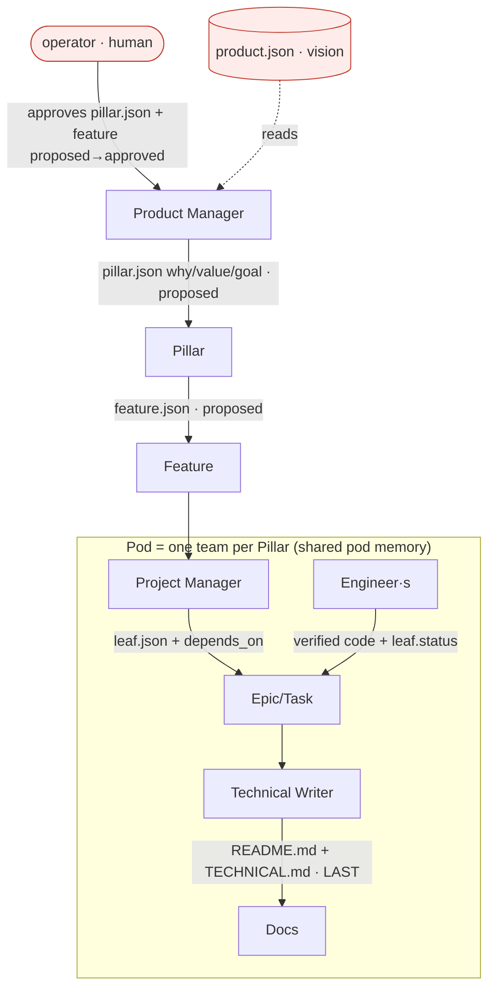
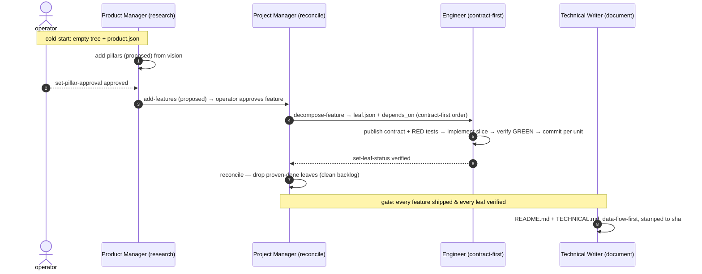
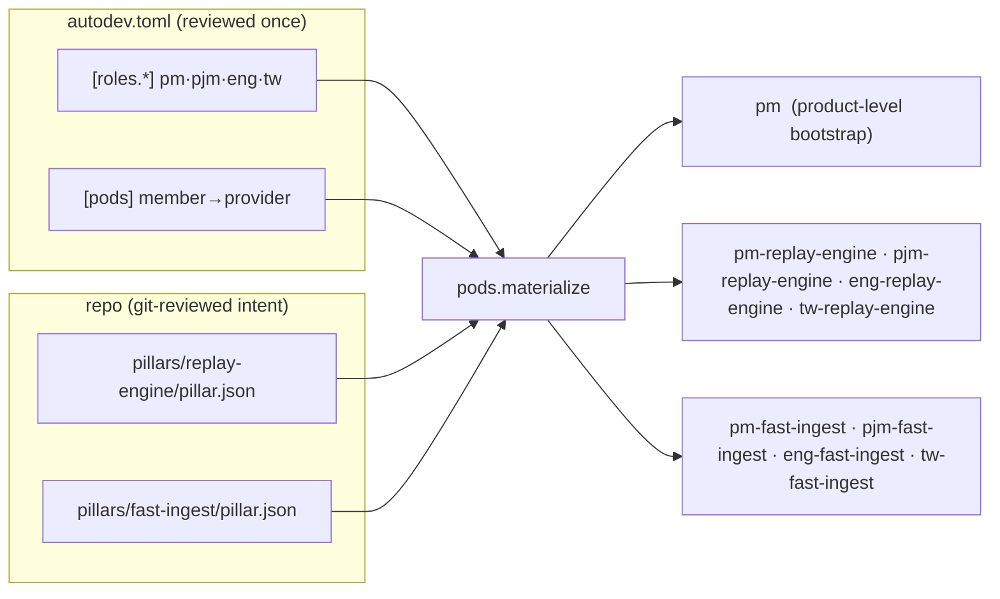
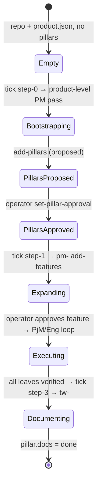
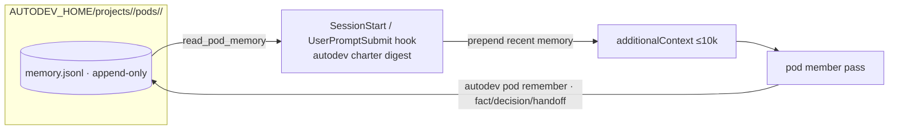

# Deterministic Company Scaffold

**Status:** proposed · **Builds on:** `docs/design/product-tree-observability.md` (merged) · **Descriptor:** stays schema 3
**Classification:** FEATURE (net-new capability — pre-built persona pods, dynamic instantiation, cold-start). This document is the gate.

The observability layer shipped the product **tree** (`Pillar → Feature → Leaf`), the trace/DAG, durable role law, and the PreToolUse teeth. It left three things implicit that a real company needs to run itself: **pillars are only directories** (no owned artifact, no operator gate), **pods are a static `[[agents]]` list** that cannot exist for a pillar that has not been created yet, and **the loop cannot cold-start** — `orchestrator._pillar_dirs` returns `[]` on an empty tree (`orchestrator.py:70-74`), and `tick` is not even wired to a CLI verb.

This design makes the org chart deterministic: **`Product → Pillar (Product Manager) → Feature (Pod) → Epic/Task (Engineers + PjM) → Docs (Technical Writer, last)`**, with **one pod stamped per pillar**, **pod-scoped shared memory**, and a **cold-start** where a product-level PM turns a written product vision into the first pillars. The company functions "the way humans do it": the operator approves intent at the boundaries; everything downstream runs autonomously.

Every seam below is grounded in the merged code at `6aee5c7`; deviations from the brief are called out where the code forced a cleaner decomposition.

---

## Problem

One line: **you cannot start a product from nothing, and you cannot grow teams as the product grows.**

Observable today, on the merged runtime:

- `enumerate_tree` globs `*/features/*/feature.json` and groups by directory (`product.py:245`). A pillar is a name with no owned artifact — no "why", no value prop, no operator approval gate. `pillar.json` does not exist (`rg` clean).
- `orchestrator.tick` expands an *empty pillar directory* into features (`orchestrator.py:162`), but `_pillar_dirs` lists only directories that already exist (`orchestrator.py:70-74`). A truly empty repo + a product idea produces **nothing** — no step creates the first pillars, and there is no `product.json` vision to create them from.
- Pods are the static `[[agents]]` list (`config.py:321-346`); `_select_agent` matches `agent.pod == feature["pillar"]` else falls back to the first agent (`orchestrator.py:101-111`). A pillar invented at runtime has **no pod**, because `autodev.toml` was written before the pillar existed.
- There is no Technical Writer role (`ROLE_SHAPES = {research, contract-first, reconcile}`, `config.py:19`), so docs are never produced, let alone produced *last*.
- `examples/autodev.toml` is still `schema_version = 2` (line 1) and no longer loads.

Goal: pillars become first-class PM-owned artifacts with an operator gate; each pillar gets its own pod materialised from a template; pods share memory; a cold-start bootstraps pillars from a vision; and the loop is runnable.

---

## Data flow

### The org / tier tree — who owns each level, and the artifact at each edge



- **Pillar** = a major product area. Artifact `pillar.json` (why · value · goal). **Owned by the Product Manager**, gated by the **operator**. **Pillars determine the pods** — a pod is stamped for each pillar.
- **Feature** = the shape of a pillar. Artifact `feature.json`. Owned by the pillar's **pod**.
- **Epic/Task** = the backlog. Artifact `leaf.json` is the Task (the unit an Engineer verifies). **"Epic" is an optional grouping label over sibling leaves — not a file tier.** Managed by Engineers + the Project Manager; cleaned after validation.
- **Docs** = `README.md` + `TECHNICAL.md` per pillar, produced by the **Technical Writer as the last step**, stamped to the verified sha.

### The deterministic flow — every hand-off edge carries a typed artifact



No role improvises the flow: each edge is a typed `autodev product` / `autodev pod` verb, validated at the boundary (the same contract pattern as `autodev trace emit`).

### Dynamic per-pillar pod instantiation



`autodev.toml` declares the **template**, not the teams. The effective agent set is derived from the pillars that exist — the descriptor never auto-mutates, and it stays human-reviewed. As a `pillar.json` appears in the tree, its pod appears in the runtime.

### Cold-start — the loop starting from nothing



Everything below the Product Manager is **gated until pillars exist and are approved** — structurally, because no pillar means no feature means the feature/docs steps are no-ops.

### Pod-scoped shared memory — read before acting, write durable handoffs after



The **record** is typed (a schema-validated envelope with `seq`, honouring the ethos "data is the source"); the **body** is the model's own prose. Reading is automatic — the pod's recent memory rides the charter digest that already survives compaction (`cli.py:211-235`). Writing is one typed verb.

---

## System design — where each piece lives and why

New modules (one responsibility each, small surface):

| module | owns (one line) | composes |
|---|---|---|
| `pods.py` | materialise the pod template × existing pillars → the effective `AgentConfig` set (ids, providers, write/read roots) | `config.py` (PodTemplate), `product.py` (pillar glob) |
| `podmemory.py` | pod-scoped shared-memory store: envelope schema, append writer, filtered reader | `state.py` (paths) |

Extended modules (wrap, do not rewrite):

- `product.py` — `pillar.json` + `product.json` schema/validators; `add_pillars`, `set_pillar_approval`, `set_pillar_docs`; `enumerate_tree` keyed on `pillar.json`; `add_features` defaults `loop` to `loop.sequence`. The typed-verb + fail-fast pattern (`product.py:361-458`) is the template.
- `config.py` — `ROLE_SHAPES += "document"` (`config.py:19`); `[pods]` → `PodTemplate` (mirrors `_parse_roles`/`_parse_loop`, `config.py:245-273`); `[[agents]]` **or** `[pods]` required; `write_roots` may be empty (a verb-only role).
- `orchestrator.py` — cold-start step-0; pillar approval gate + expansion; deterministic pod-member selection; docs-last step-3; `_ROLE_KIND[technical-writer]`. `tick` still only composes `start_session`/`ensure_workspace` behind the `launch` seam (`orchestrator.py:114-136,152`).
- `trace.py` — `_NODE_LEVELS += "product"` (`trace.py:38`); `STEP_KINDS`/`_AGENT_TYPE_KIND += "document"` (`trace.py:36,390`).
- `prompts.py` — `SHAPE_PERSONA["document"]`; `compose_law` embeds the shared operator law + the read-pod-memory instruction (`prompts.py:10,35`).
- `policy.py` — verb-authority rows (which role may call which `autodev product`/`pod` verb) + a technical-writer no-source-edit row (`policy.py` decision table).
- `state.py` — `pods` on `ProjectPaths` + `pod_memory_path` (mirrors `runs`/`laws`, `state.py:27-44`).
- `workspaces.py` — role/kind sparse defaults for `document` (TW reads `src/impl/<pillar>` for docs) (`workspaces.py:52`).
- `cli.py` — `autodev orchestrate` (wire `tick`, absent today), `autodev product add-pillars`/`set-pillar-approval`, `autodev pod remember`; charter digest prepends pod memory (`cli.py:211-235,292-370`).
- `service.py` — payloads/dashboard use materialised pods; pillar cards show why/value/approval/docs + pod members (`service.py:84-94,196-200`).
- `templates.py` — emit the default company scaffold (`[roles.*]` pm/pjm/eng/tw, `[loop]`, `[pods]`) + `product.json` (`templates.py:44`).
- `examples/autodev.toml` — replace the stale schema-2 file with that scaffold.
- `skills/autodev-operator/SKILL.md` + `references/descriptor.md` — the "start a new product" setup flow; document `pillar.json`/`product.json`/`[pods]`/technical-writer.

**Why the boundaries.** `pods.py` is a pure function of `(descriptor template, pillars on disk)` → replayable and testable with a fake tree; it never launches anything. `podmemory.py` is an append-only store shaped exactly like `trace.py`, so its determinism argument is the same. Tree authorship stays inside `product.py`'s verbs (integration checkout), so no role writes tree JSON from its worktree — which is what lets PM/PjM be **verb-only** roles and lets per-pillar pods keep disjoint worktree ownership without touching `_validate_ownership`.

---

## The pre-built persona charter templates

The deliverable. Each persona is defined by **owns · input · deterministic flow · output artifact(s) · hands-to · escalates · done-when · pod-memory interaction**. The rich template below is the source of truth; the condensed form lands in `[roles.<id>].charter`, and `prompts.compose_law` renders `charter ⊕ shape-persona ⊕ loop-law ⊕ operator-law ⊕ pod-memory-rule` into the durable law placed where compaction cannot erase it (system-prompt append for Claude, SessionStart/UserPromptSubmit digest for both — `providers.py:112-123`, `cli.py:211-235`).

**Shared operator law (embedded in every charter, `compose_law`):** contract-first; TDD / eval-driven (red before green); every unit stated as `input → output → unit test → integration test → the one module it lives in`, and a unit lives in exactly one module; one canonical path, fail fast on a missing prerequisite (no stub/fallback/"v2"); the backlog is cleaned after validation; docs are written last; mutate the tree only through the typed `autodev product`/`autodev pod` verbs.

### product-manager — shape `research`

| field | value |
|---|---|
| **owns** | the **Pillar** tier: `pillar.json` (why · value · goal) and the pillar's Features while `proposed`. |
| **input** | cold-start: `product/product.json` (the vision). Steady state: an `approved` `pillar.json` with no features, or a `reenter_product_manager_when` trigger. |
| **deterministic flow** | `research`: plan queries → fan out one search per query → distil each into a fact `{claim, source, date, relevance}` → fan the facts in → synthesise, ranking recency×relevance → emit pillars (cold-start) or features (expansion). |
| **output** | cold-start: `add-pillars` → `pillar.json` (proposed). Expansion: `add-features` → `feature.json` (proposed), `loop` stamped from `loop.sequence`. |
| **hands-to** | the operator (to approve a pillar / feature), then `project-manager` once a feature is approved. |
| **escalates** | to the operator on every pillar and every feature — nothing PM emits is scheduled downstream until a human flips `proposed → approved`. |
| **done-when** | every seeded vision item is a `proposed` pillar; every approved pillar with no features has its `proposed` features. |
| **pod-memory** | product-level PM writes a `decision` per created pillar into that pillar's pod memory (the pod's founding rationale). Reads the pillar's pod memory before re-expanding. |

### project-manager — shape `reconcile`

| field | value |
|---|---|
| **owns** | the **Feature** shape and the pillar's backlog: `leaf.json` files + `depends_on` edges; reconciling stale gates; cleaning proven-done leaves after validation. |
| **input** | an `approved` `feature.json` whose loop frontier is `project-manager`. |
| **deterministic flow** | `reconcile`: read committed work + existing leaves → split the feature into complete, contract-anchored leaves ordered contract-first → emit `depends_on` edges (an "inbox" is an unmet edge, never prose) → drop leaves proven done. |
| **output** | `decompose-feature` → `leaf.json` per task + updated `feature.json.leaves`; later `set-leaf-status` on reconcile. |
| **hands-to** | the pillar's Engineers (executable leaves), then itself (reconcile pass), then — once all leaves verify — the Technical Writer via the docs gate. |
| **escalates** | to the operator only on a roadmap contradiction (raises a PM re-entry proposal); **never approves a leaf whose gate needs another pod's unmerged work.** |
| **done-when** | every feature leaf is contract-anchored and reachable; no unmet `depends_on` targets a non-sibling; the backlog holds no proven-done leaf. |
| **pod-memory** | reads the pod memory for prior decompositions and open handoffs before splitting; writes a `handoff` per emitted leaf and a `decision` per gate correction. |

### engineering — shape `contract-first`

| field | value |
|---|---|
| **owns** | the **Task/leaf**: its contract slice, its tests, and its implementation under `src/impl/<pillar>/` + `tests/<pillar>/`. |
| **input** | a leaf whose `depends_on` targets are all `verified` (a physically executable leaf). |
| **deterministic flow** | `contract-first`: publish the interface + RED (failing) unit/integration tests before any internals → implement only its own slice → verify GREEN → commit per unit. Integration reads eval signals, not another slice's source (enforced physically by sparse checkout, `workspaces.py:69-71`). |
| **output** | verified code committed on its branch; `set-leaf-status <leaf> verified`. |
| **hands-to** | the Project Manager (reconcile/clean), which in turn releases the Technical Writer. |
| **escalates** | stops and reports the exact cross-boundary need rather than editing another pod's path (matching `render_goal` clause 3, `prompts.py:90-93`). |
| **done-when** | `uv run pytest` (project `verify_commands`) is green for the slice; the leaf is `verified`; the diff is inside `src/impl/<pillar>/`+`tests/<pillar>/`. |
| **pod-memory** | reads the pod memory for the contract decisions and prior red/green history; writes a `fact` recording the verified contract shape and any discovered constraint. |

### technical-writer — shape `document` (new)

| field | value |
|---|---|
| **owns** | the pillar's docs: `product/pillars/<pillar>/README.md` + `TECHNICAL.md`. |
| **input** | a pillar where every feature is shipped, every leaf is `verified`, and `pillar.json.docs == pending` (the docs-last gate). |
| **deterministic flow** | `document`: read the verified source + the pod memory → produce a **highly condensed, data-flow-first "caveman" technical map** (flows before prose; `a ─> b ─> c`), stamped to the verified sha. |
| **output** | `README.md` (what/why, run it) + `TECHNICAL.md` (data flow, contracts, where each piece lives); `set-pillar-docs done`. |
| **hands-to** | the operator (the pillar is now shippable and documented). |
| **escalates** | reports, never edits, if the verified source contradicts the intent it was asked to document. |
| **done-when** | both files exist under the pillar, reference the verified sha, and contain no source edits (policy-enforced); `pillar.json.docs == done`. |
| **pod-memory** | reads the whole pod memory (its primary source for "why it is shaped that way"); writes a final `decision` linking the docs sha. |

### operator — the human control plane (not an agent)

| field | value |
|---|---|
| **owns** | the gates: approve `pillar.json`; approve a feature `proposed → approved`; resolve escalations; set priority. The seat the loop will not auto-advance past. |
| **input** | the dashboard / CLI: proposed pillars and features, unmet edges, run DAGs. |
| **flow** | `set-pillar-approval approved` · `product set-approval <feature> approved` · answer a PM re-entry proposal. |
| **output** | approval state on nodes — "the tree is the human control plane" made literal (ethos §0.7). |
| **done-when** | intent boundaries are decided; execution of already-approved intent needs no further gate. |
| **pod-memory** | read-only via the dashboard; the operator never writes pod memory. |

The `research` / `contract-first` / `reconcile` shape personas already exist (`prompts.py:10-26`); this design **adds `document`** and leaves the other three unchanged.

---

## Tier / artifact contracts

### C-P1 · `pillar.json` — `product.py`

```jsonc
{
  "id": "replay-engine",        // ^[a-z][a-z0-9-]{0,28}$  (≤28 so stamped pod ids fit _ID_RE's 32)
  "name": "Replay Engine",
  "why": "one line: the problem this area exists to solve",
  "value": "the value proposition delivered",
  "goal": "the observable outcome that means this pillar is done",
  "approval": "proposed",       // proposed | approved   — the operator gate
  "docs": "pending"             // pending | active | done — the docs-last checkpoint (optional, defaults pending)
}
```

Rules (fail-fast, mirroring `product.validate_feature`): unknown keys rejected; `id` matches a **28-char-max** id form (not the shared `_ID_RE`'s 32, so `eng-<pillar>`/`pjm-<pillar>` stay ≤32); required `{id,name,why,value,goal,approval}`; `approval ∈ {proposed,approved}`; `docs ∈ {pending,active,done}`. `id` must equal the parent directory.

### C-P2 · `product.json` — `product.py`

```jsonc
// product/product.json — the cold-start vision seed (git-reviewed, operator-authored at setup)
{ "vision": "what we are building and for whom", "constraints": ["optional hard constraints"] }
```

Lives at `product/product.json` (sibling of `product/pillars/`). Required `{vision}`; optional `constraints[]`. Read-only intent thereafter — the PM reads it to bootstrap; it is never rewritten by an agent.

### C-P3 · Epic-as-label

An **Epic is a `leaf.json` field, not a file tier**: add optional `epic: str` to `leaf.json` (a grouping label over sibling leaves). No `epic.json`, no directory. The dashboard groups sibling leaves by `epic` when present. This keeps the tree exactly three file tiers (`pillar → feature → leaf`).

### C-P4 · `[pods]` pod template — `config.py`

```toml
[pods]
[pods.members.product-manager]   # member id must name a configured [roles.*]
provider = "claude"
[pods.members.project-manager]
provider = "claude"
[pods.members.engineering]
provider = "codex"
[pods.members.technical-writer]
provider = "claude"
```

Parses to `PodTemplate(members: dict[str, PodMember])`, `PodMember(role, provider, model?, effort?)`. Each `role` must be a configured `[roles.*]`; `provider ∈ SUPPORTED_PROVIDERS`. Purpose/goal/write-roots/read-roots are **derived** (see C-P5), not declared — the template is the team shape, nothing more.

### C-P5 · pod materialisation — `pods.py`

Deterministic derivation, given the descriptor's `PodTemplate` + roles/loop and the pillars globbed from `product/pillars/*/pillar.json`:

| stamped agent | when | write_roots | read_roots (+ automatic context) | pod |
|---|---|---|---|---|
| `pm` | always (product-level bootstrap) | **∅ (verb-only)** | `product/` | — |
| `pm-<P>` | per pillar P | **∅ (verb-only)** | `product/pillars/<P>/` | `<P>` |
| `pjm-<P>` | per pillar P | **∅ (verb-only)** | `product/pillars/<P>/features/`, `contracts/` | `<P>` |
| `eng-<P>` | per pillar P | `src/impl/<P>/`, `tests/<P>/` | `contracts/`, `product/pillars/<P>/features/` | `<P>` |
| `tw-<P>` | per pillar P | `product/pillars/<P>/README.md`, `product/pillars/<P>/TECHNICAL.md` | `src/impl/<P>/`, `product/pillars/<P>/` | `<P>` |

```python
# pods.py public surface
def materialize(project: ProjectConfig) -> tuple[AgentConfig, ...]   # static agents ∪ product-level pm ∪ per-pillar pods
def pod_agent_id(role: str, pillar: str | None) -> str               # "pm" | "eng-replay-engine" | ...
def select_member(project: ProjectConfig, role: str, pillar: str | None) -> str  # deterministic pick for the orchestrator
```

`materialize` reuses `config._validate_ownership` on the union so an accidental overlap still fails fast. The write-root partition (`pillar.json` / `features/` / `src/impl/<P>` / `README+TECHNICAL`) is **verified disjoint** by `_roots_overlap`, both within a pod and across pillars.

**Why `pm`/`pjm` are verb-only (∅ write_roots).** All tree authorship (`pillar.json`, `feature.json`, `leaf.json`, loop/approval/docs states) is written by the typed `product.py` verbs into the **integration checkout**, never from a worker's worktree. PM and PjM therefore own no worktree paths; their output is the tree, mediated by verbs. Empty `write_roots` means the ownership gate correctly flags any direct worktree edit, and the orchestrator never `merge`s a verb-only branch. This is the change that makes per-pillar pods composable without relaxing the overlap rule.

### C-P6 · pod-memory envelope — `podmemory.py`

`AUTODEV_HOME/projects/<id>/pods/<pillar>/memory.jsonl`, append-only, single-writer-per-append (like `trace.emit`):

```python
KINDS = frozenset({"fact", "decision", "handoff"})
def append_pod_memory(project_id, pillar, *, role, agent, run_id, kind, text) -> int   # returns seq
def read_pod_memory(project_id, pillar, *, kinds=None, since=0) -> list[dict]           # filtered, ordered
```

Each line: `{seq, ts, pillar, role, agent, run_id, kind, text}`. The envelope is schema-validated (honours the ethos — the record is typed, the `text` body is free prose). `seq` is monotonic per pod, assigned by reading the current max (single writer, no lock — same argument as `trace.emit`, `trace.py:157-174`).

---

## Descriptor: the default company scaffold (schema 3)

Additive — a schema-3 descriptor with only `[[agents]]` still loads. New: `[pods]`, the `technical-writer` role, and the relaxations (below). This scaffold **is** `examples/autodev.toml` after this change, emitted by `templates.default_company_descriptor()`.

```toml
schema_version = 3

[project]
id = "acme"
name = "Acme"
base_branch = "main"
instructions = "One canonical path, fail fast, uv for Python. The product tree is authored only through autodev verbs."
context_roots = ["contracts/", "product/product.json"]
verify_commands = ["uv run pytest"]

[runtime]
session_pattern = "autodev-{project}-{agent}"
ui_port = 8765
bypass_permissions = false

[loop]
sequence = ["project-manager", "engineering", "project-manager"]   # the FEATURE loop; PM/TW are pillar-level, not entries here
reenter_product_manager_when = ["new-requirement", "queues-exhausted", "roadmap-contradiction"]
max_concurrent = 4

[roles.product-manager]
shape = "research"
charter = "Own the Pillar tier. Bootstrap pillars from product.json; expand an approved pillar into proposed Features. Everything you emit is proposed until the operator approves."
[roles.project-manager]
shape = "reconcile"
charter = "Own the Feature shape and the backlog. Split into contract-anchored leaves + depends_on edges; never approve a leaf whose gate needs another pod's unmerged work; clean proven-done leaves after validation."
[roles.engineering]
shape = "contract-first"
charter = "Own the Task/leaf. Interfaces + RED tests before internals; implement your slice only; verify green; commit per unit."
[roles.technical-writer]
shape = "document"
charter = "Own the pillar docs. Run only after every leaf verifies. Produce a condensed, data-flow-first README + TECHNICAL map stamped to the verified sha. Never edit source."

[pods]
[pods.members.product-manager]
provider = "claude"
[pods.members.project-manager]
provider = "claude"
[pods.members.engineering]
provider = "codex"
[pods.members.technical-writer]
provider = "claude"
```

Validation deltas, grounded in `config.py`:

- `ROLE_SHAPES` gains `"document"` (`config.py:19`); `_parse_roles` (`config.py:245-259`) then accepts it unchanged.
- `[pods]` → `PodTemplate` via a `_parse_pods` mirroring `_parse_loop` (`config.py:262-273`): each member id is `_id`; each `role` is a configured `[roles.*]`; `provider ∈ SUPPORTED_PROVIDERS`; `model`/`effort` optional.
- **`[[agents]]` OR `[pods]` required** — relax `config.py:322` (currently raises if `[[agents]]` is absent) so a pure-template descriptor loads.
- **`write_roots` may be empty** — relax `config.py:342` (`allow_empty=False`) to allow a verb-only role; `_validate_ownership` (`config.py:172-181`) already ignores empties.
- `ProjectConfig` gains `pods: PodTemplate | None = None`.

---

## Units of work

Format: `in → out → unit test → integration test → the one module`. Ordered by dependency; each leaves the repo green. New tests extend `tests/test_<module>.py`; integration reuses `project_repo` + `product_tree` (`tests/conftest.py`), which gain a `pillar.json` + `product.json` (E2/D0b).

### Phase D — schema (freeze first)

- **D0** `validate_pillar(obj)` → normalised pillar dict; unknown key / bad `approval` / id>28 raises `ProductError` · unit: valid + each invalid fixture · int: a seeded `pillar.json` validates · **`product.py`**.
- **D0b** `validate_product(obj)` + `product_json_path`/`load_product_vision` · in: dict/path → out: `{vision,constraints}` · unit: missing `vision` raises · int: `product/product.json` loads · **`product.py`**.
- **D1** `ROLE_SHAPES += "document"`; `[roles.technical-writer]` with `shape="document"` loads · unit: descriptor with the role parses; unknown shape still rejected · int: `load_project` on the scaffold · **`config.py`**.
- **D2** `[pods]` → `PodTemplate` · in: TOML → out: `PodTemplate` · unit: member naming an undeclared role rejected; bad provider rejected · int: scaffold loads with `project.pods` set · **`config.py`**.
- **D3** `[[agents]]` **or** `[pods]` required; empty `write_roots` allowed · unit: template-only descriptor loads; descriptor with neither rejected; a verb-only agent (∅ roots) loads · int: scaffold (no `[[agents]]`) loads · **`config.py`**.

### Phase E — pillars, vision, tree

- **E1** `add_pillars(project, pillars)` → one `pillar.json` per spec, validated then written atomically; id>28 raises before writing · unit: writes valid file; invalid payload writes nothing · int: `add_pillars` then `enumerate_tree` shows the pillar · **`product.py`**.
- **E2 (RD)** `enumerate_tree` keyed on `pillar.json`: glob `product/pillars/*/pillar.json` → pillar meta+approval; nest `features/*/feature.json`; a feature under a pillar with no `pillar.json` fails fast; a pillar with zero features still enumerates; `PillarView` carries the pillar dict · unit: tree fixture → pillars with meta; dangling feature raises · int: `product_tree` (now with `pillar.json`) enumerates · **`product.py`**.
- **E3** `set_pillar_approval(project, pillar, approval)` + `set_pillar_docs(project, pillar, state)` (mirror `set_approval`/`set_loop_state`) · unit: flips validated field atomically; bad enum raises · int: approve then re-enumerate · **`product.py`**.
- **E4** `add_features` defaults `loop` to `[{role,"pending"} for role in loop.sequence]` when the spec omits it (PM/TW never in the feature loop) · unit: omitted loop → sequence loop; explicit loop preserved · int: PM-emitted feature has the PjM→Eng→PjM loop · **`product.py`**.

### Phase F — dynamic pods

- **F1** `pods.materialize(project)` → static agents ∪ `pm` ∪ per-pillar `{pm,pjm,eng,tw}-<P>` with the C-P5 roots; `select_member`/`pod_agent_id` · in: project + tree → out: `AgentConfig[]` · unit: 2-pillar fake tree → 1+8 agents, expected ids/roots, overlap-free (via `_validate_ownership`); id>32 guard · int: `materialize(load_project(scaffold))` on `product_tree` · **`pods.py`**.

### Phase G — pod memory

- **G1** `pods` on `ProjectPaths` + `pod_memory_path(project_id, pillar)` · unit: path equals `home/pods/<pillar>/memory.jsonl` · int: created on first append · **`state.py`**.
- **G2** `append_pod_memory`/`read_pod_memory` (envelope schema, monotonic `seq`, fsync; `kinds`/`since` filters) · unit: two appends → seq 1,2; bad `kind` raises; filtered read · int: append then read round-trips · **`podmemory.py`**.
- **G3** `autodev pod remember --pillar <P> --kind <k>` reads text from stdin, resolves `AUTODEV_PROJECT`/`AUTODEV_ROLE`, appends · unit: piped text appends one entry · int: CLI invocation writes the line · **`cli.py`**.
- **G4** `charter digest` prepends the pillar's recent pod memory (bounded) ahead of the law within the 10k budget · unit: digest JSON contains a recent memory line then the law · int: hook spec routes SessionStart to it and memory appears · **`cli.py`**.

### Phase H — personas & law

- **H1** `SHAPE_PERSONA["document"]` + `compose_law` handles the `document` shape (no `KeyError`) · unit: `compose_law` for a `document` role emits data-flow-first framing · int: `render_goal` for a `tw-<P>` agent includes it · **`prompts.py`**.
- **H2** `compose_law` embeds the shared operator law + the read-pod-memory rule · unit: composed law contains "input → output → unit test → integration test" and "written last" · int: an engineering law includes contract-first + operator law · **`prompts.py`**.

### Phase I — orchestrator

- **I0** `trace._NODE_LEVELS += "product"`; `STEP_KINDS`/`_AGENT_TYPE_KIND += "document"` · unit: a `product`-level `run_started` validates; a `document` subagent maps to a `document` stage · int: fold a TW run → a document node · **`trace.py`**.
- **I1** cold-start step-0: empty tree + `product.json` → schedule a product-level PM pass (agent `pm`, `node_ref.level="product"`), emit `phase_changed`; no `product.json` → no-op · unit: empty tree + vision → one `pm` decision; empty tree + no vision → none · int: tick on a bootstrap fixture schedules `pm` · **`orchestrator.py`**.
- **I2** pillar gate + expansion: `pillar.json` approved & no features → schedule `pm-<P>` to add features; `proposed` pillar → `gated`; supersedes the directory-based `_pillar_dirs` (`orchestrator.py:70-74,162`) · unit: approved-empty → scheduled; proposed → gated · int: approve a seeded pillar → tick schedules `pm-<P>` · **`orchestrator.py`**.
- **I3 (RD)** `select_member`-based agent selection for every scheduled role-instance (product PM→`pm`, pillar PM→`pm-<P>`, PjM→`pjm-<P>`, Eng→`eng-<P>`, TW→`tw-<P>`), replacing `_select_agent` (`orchestrator.py:101-111`) · unit: each (level,role,pillar) → expected agent id · int: a feature loop launches `pjm-<P>` then `eng-<P>` (fake launcher) · **`orchestrator.py`**.
- **I4** docs-last step-3: approved pillar where every feature is `shipped`, every leaf `verified`, `pillar.docs=="pending"` → schedule `tw-<P>`, set `docs=active`; run done → `docs=done`; otherwise `gated` · unit: all-verified → scheduled; one leaf unverified → gated · int: a fully-shipped pillar → tick schedules `tw-<P>` and flips docs · **`orchestrator.py`**.

### Phase J — enforcement & sparse

- **J1** policy verb-authority rows: only `product-manager` may `product add-pillars`/`add-features`; only `project-manager` may `product decompose-feature`; only `engineering` may `product set-leaf-status`; `technical-writer` denied any `Write`/`Edit` outside the pillar docs · in: `PolicyInput` (role/kind/tool/`tool_input`) → out: `PolicyDecision` · unit: each row allow/deny · int: N/A (pure) · **`policy.py`**.
- **J2a** `_ROLE_KIND[technical-writer]="document"` · unit: TW decision carries kind `document` · int: a scheduled TW session env has `AUTODEV_KIND=document` · **`orchestrator.py`**.
- **J2b** `sparse_paths` for kind `document`: TW sees `src/impl/<P>` read-only + pillar dir (already via read_roots) · unit: document kind keeps `src/impl/<P>` present (unlike `integrate`) · int: a `tw-<P>` worktree has the pillar source on disk · **`workspaces.py`**.

### Phase K — CLI, service, templates, example, skill

- **K1** `autodev orchestrate [--watch] <project>` → `orchestrator.tick` (absent today) · unit: one tick returns decisions (fake launcher) · int: `autodev orchestrate` on a bootstrap repo schedules `pm` · **`cli.py`**.
- **K2** `autodev product add-pillars --pillar <P>`-less form: JSON array on stdin + `set-pillar-approval --pillar <P> --approval <a>` (mirror `cli.py:292-370`) · unit: piped array writes pillars; bad approval rejected · int: CLI add-pillars then enumerate · **`cli.py`**.
- **K3** service: `_project_payload` + product payload use `pods.materialize`; pillar cards render why/value/approval/docs + pod members · unit: `_product_payload` includes pillar meta; `_dashboard` HTML shows pod members + docs badge · int: threaded server returns materialised agents (`tests/test_service.py` pattern) · **`service.py`**.
- **K4** `templates.default_company_descriptor()` + `default_product_json(vision)` → a schema-3 scaffold that `load_project` accepts (roles pm/pjm/eng/tw, `[loop]`, `[pods]`) · unit: render→load round-trips as schema 3 with `project.pods` set · int: the emitted `product.json` validates · **`templates.py`**.
- **K5** replace `examples/autodev.toml` with `default_company_descriptor()` output · unit: `load_project(examples/autodev.toml)` succeeds and is schema 3 with 4 roles + a pod template · int: N/A · **`examples/` + `tests/`**.
- **K6** `SKILL.md` "Start a New Product" flow (ask continue-existing / start-new; for new, ask "what do you want to build?" → write scaffold `autodev.toml` + `product/product.json` → commit both → register → `autodev orchestrate`); `references/descriptor.md` documents `pillar.json`/`product.json`/`[pods]`/technical-writer · unit: N/A (docs) · int: N/A · **`skills/autodev-operator/`**.

**Dependency order:** `D0/D0b/D1/D2/D3 → E1/E2/E3/E4 → F1 → G1/G2 → H1/H2 → I0 → I1/I2/I3/I4 → J1/J2a/J2b → G3/G4/K1/K2 → K3/K4/K5/K6`.

---

## Re-decompositions from the brief (and why)

Each keeps every unit to one module and testable with collaborators faked.

1. **`enumerate_tree` keyed on `pillar.json`, not directories (E2).** The brief says "enumeration/tick recognize a pillar from `pillar.json`." Merged code groups by directory (`product.py:245`) and a feature-less pillar vanishes — fatal for cold-start (a PM creates a pillar before any feature). E2 makes `pillar.json` the enumeration key; the `product_tree` fixture gains a `pillar.json`.
2. **PM/TW are not feature-loop entries (E4).** The brief's flow has PM at the pillar tier and TW as the last pillar step. The merged fixture put `product-manager` in `feature.loop`. The FEATURE loop is `loop.sequence` (`PjM→Eng→PjM`); PM expands pillars, TW documents pillars — both driven by dedicated orchestrator steps, not the per-feature loop. `add_features` stamps the sequence loop.
3. **Deterministic pod-member selection replaces `_select_agent` (I3).** Merged `_select_agent` (`orchestrator.py:101-111`) matches `pod==pillar` else the first agent — undefined once agents are materialised per pillar. I3 selects `f"{abbrev(role)}-{pillar}"` (and `pm` at product level).
4. **PM/PjM are verb-only, ∅ write_roots (C-P5, D3, F1).** The brief expected the runtime to "grow the descriptor / agent set." Writing generated `[[agents]]` back into the reviewed `autodev.toml` at runtime breaks "the committed descriptor is authoritative" and the human-review model. Instead the descriptor declares a template and pods are **derived** from the git-reviewed pillars — no descriptor mutation. That forces PM/PjM (who author only the tree, via verbs into the integration checkout) to own no worktree paths, hence the empty-`write_roots` relaxation.
5. **`autodev orchestrate` added (K1).** `orchestrator.tick` exists but is wired to no CLI verb (confirmed) — there is no way to run the loop or cold-start today. The SKILL "launch" step needs it.
6. **A product-level `pm` bootstrap agent (C-P5, I1).** Pods are per pillar, but cold-start creates the first pillars *before* any pod exists. A single product-level `pm` (stamped from the PM template member) resolves the chicken-and-egg; it is verb-only, so it does not overlap the per-pillar `pm-<P>`.

---

## Rejected alternatives

- **Materialise pods by writing `[[agents]]` into `autodev.toml` at runtime.** Mutates a git-reviewed file behind the operator's back; conflicts with the UI editor and "the committed descriptor is authoritative" (`SKILL.md`). Derive pods from the pillars instead.
- **`load_project` globs the product tree to expand pods.** Couples config parsing to the filesystem tree and breaks contexts where the tree is absent. Keep `load_project` pure; expand in `pods.materialize`.
- **Give PM/PjM a token worktree write root** (e.g. a `notes/` dir) to satisfy the non-empty rule. Dishonest ownership and risks overlap. Empty `write_roots` is the truthful model for a verb-only role.
- **TW as a per-feature loop entry.** Docs are per pillar and must be last; a per-feature TW entry would write pillar docs N times and gate on one feature. Model docs as a pillar-level `docs` checkpoint gated on the whole pillar.
- **`epic.json` as a fourth file tier.** A merge hotspot and a needless tier; the brief says Epic is a label. `leaf.epic` is a field.
- **Pod memory as Markdown (`memory.md`).** Prose-as-truth is the core anti-pattern (ethos §0.1). A typed append-only JSONL envelope with a free-text body keeps the record structured.
- **Pod memory in the repo.** It is live execution state shared across passes, not durable intent; it belongs under `AUTODEV_HOME` (ethos §0.6). Durable decisions get promoted into the tree via verbs.
- **A CLI `read-pod-memory` verb the role must remember to call.** Reading must be guaranteed; injecting recent memory into the charter digest (which already survives compaction) makes "read before acting" automatic.

---

## Risks & open questions

**Needs an operator decision (top priority):**

- **Pod-memory mechanism (open decision #5).** Recommendation: **append-only JSONL per pod under `AUTODEV_HOME/projects/<id>/pods/<pillar>/memory.jsonl`**, typed envelope `{seq,ts,pillar,role,agent,run_id,kind∈{fact,decision,handoff},text}`, written by `autodev pod remember`, read automatically by prepending recent entries to the `charter digest` additionalContext. Sign-off needed on: (a) this store vs. a git-reviewed per-pillar memory file; (b) auto-inject-via-digest vs. an explicit read verb; (c) the 10k budget split between recent memory and the role law.
- **Dynamic-pod declaration (open decision, from delta #4).** Recommendation: **the descriptor declares a `[pods]` template; pods are derived per existing pillar by `pods.materialize`, never written back into `autodev.toml`.** Sign-off needed on: PM/PjM being **verb-only** roles with empty `write_roots`, and on the per-role write-root partition in C-P5.
- **PM in the pod vs. product-level (delta #4 vs. cold-start).** Recommendation: keep `pm-<P>` in each pod for pillar/feature work **and** a product-level `pm` for bootstrap. Sign-off needed if the operator prefers a single product-level PM with no per-pillar PM.
- **Should Pillar→Feature expansion and feature approval both gate, or run autonomous?** Recommendation (unchanged from the merged design's decision #4): gate at intent boundaries (pillar approval, feature `proposed→approved`), autonomous downstream.

**Technical risks:**

- **Tree writes land uncommitted in the integration checkout.** `product.py` verbs write into `project.root/product/...` (pre-existing, `product.py:322,353`). At company scale that is a large uncommitted surface; a commit step (operator, or a follow-up unit) is needed for durability/review. Out of scope here; flagged.
- **Pod-id length.** `eng-<pillar>`/`pjm-<pillar>` must fit `_ID_RE`'s 32 chars → pillar ids capped at 28 (enforced by `validate_pillar`, C-P1). If a longer pillar id is wanted, the id scheme (or `_ID_RE`) must change first.
- **`max_concurrent` at company scale.** One tick can want to launch many pod members across pillars; the concurrency limit (`orchestrator.py:139-149,213`) must count materialised pods, not declared agents. Covered by I3/I4 counting over the materialised set.
- **No new provider API surface.** All provider mechanics (hook injection, `--append-system-prompt-file`, Codex hook overrides) are already merged and verified (`providers.py:78-129`); this design reuses them. No provider-account spike is needed and none was run.

---

## Done when (GOAL)

```
/goal Build the deterministic company scaffold per docs/design/deterministic-company-scaffold.md, one
unit at a time, committing per unit and keeping the suite green. DONE WHEN every clause holds, each
shown by the named command's output in the transcript:

1. `uv run pytest -q` exits 0 with new tests present in tests/test_product.py, tests/test_config.py,
   tests/test_pods.py, tests/test_podmemory.py, tests/test_prompts.py, tests/test_trace.py,
   tests/test_orchestrator.py, tests/test_policy.py, tests/test_workspaces.py, tests/test_cli.py,
   tests/test_service.py, tests/test_templates.py.
2. `uv run ruff check .` and `uv run ruff format --check .` both exit 0.
3. `rg -n "def validate_pillar|def add_pillars|def validate_product" src/autodev/product.py` and
   `rg -n "class PodTemplate|document" src/autodev/config.py` and
   `rg -n "def materialize|def select_member" src/autodev/pods.py` and
   `rg -n "def append_pod_memory|def read_pod_memory" src/autodev/podmemory.py` each return matches.
4. `rg -n "schema_version" examples/autodev.toml` shows version 3, and a pytest test asserts
   `load_project(examples/autodev.toml)` loads with four roles and a [pods] template
   (assert via `rg -n "examples/autodev.toml|pods" tests/test_templates.py`).
5. A pytest integration test cold-starts: an empty tree + product/product.json makes `orchestrator.tick`
   schedule a product-level `pm` pass (node_ref.level "product") that could add pillars; assert via
   `rg -n "product.json|cold|level.*product|pm\b" tests/test_orchestrator.py`.
6. A pytest test shows `pods.materialize` on a two-pillar tree returns the product-level `pm` plus one
   {pm,pjm,eng,tw}-<pillar> pod per pillar with disjoint write roots; assert via
   `rg -n "materialize|eng-|tw-|pjm-" tests/test_pods.py`.
7. A pytest test shows the docs-last gate: `tick` schedules `tw-<pillar>` only after every feature is
   shipped and every leaf verified, flipping pillar.json docs pending→done; assert via
   `rg -n "docs|technical-writer|tw-|verified" tests/test_orchestrator.py`.
8. A pytest test shows a technical-writer Write/Edit outside the pillar docs is blocked and only the
   product-manager may add-pillars/add-features (policy.decide allow/deny rows); assert via
   `rg -n "technical-writer|add-pillars|add-features|allow" tests/test_policy.py`.
9. A pytest test shows `read_pod_memory` returns what `append_pod_memory` wrote, and that
   `autodev charter digest` output contains a recent pod-memory line ahead of the role law.
10. `rg -n "orchestrate" src/autodev/cli.py` returns a match and a pytest test runs one `autodev
    orchestrate` tick with a fake launcher.

Constraints: no file outside src/autodev/, tests/, examples/, and docs/ is modified; the managed-repo
one-file invariant holds (pods are DERIVED, autodev.toml is never auto-mutated; pod memory lives under
AUTODEV_HOME); tree authorship stays inside product.py verbs; one canonical path per module, no fallback
modes. Stop after 150 turns.
```
