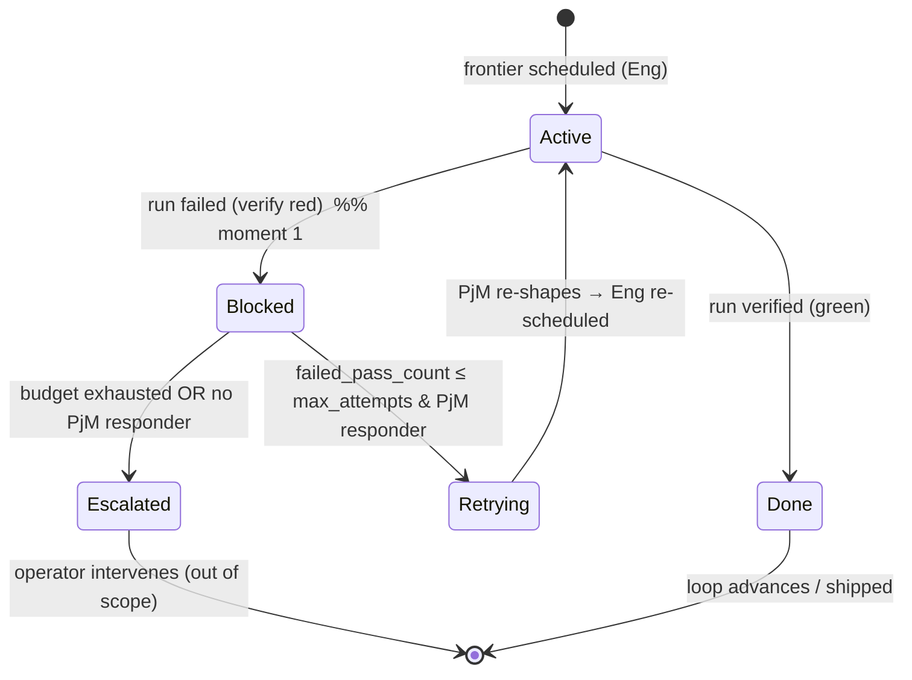

# Fail gate → bounded self-retry → operator escalation

**Status:** proposed · **Foundation:** PR #5 (`fix/tick-failed-run-blocks`, merged at `2d0689f`) · **Issue:** none (follows the hotfix)

## Problem

A failed Engineering pass on a feature *parks*. PR #5 made a failed run visibly
`blocked` instead of silently shipping (`orchestrator._drive_feature`
`orchestrator.py:222-234`), but a blocked feature has **no auto re-entry** — it sits
until a human flips it (`orchestrator.py:243-252`, the `_blocked_role` branch just
re-reports `blocked` every tick). Two gaps:

1. **No self-repair.** The natural first responder to an Engineering failure is the
   feature's Project Manager (owns the leaves / contract), but nothing routes the
   failure back to it. Every failure costs a human, even the ones a re-shape would fix.
2. **The trigger never fires.** `RunView.status == "failed"` — the condition PR #5
   keys off — **cannot occur in the live pipeline today.** The `Stop` hook hard-codes
   `run_finished status="done"` (`trace.py:462`); a verify failure is only a
   step-level `step_finished status="red"` (`trace.py:465-472`), and `to_dag`
   *drops* that red (the verify step has no `step_declared`, so `nodes.get(step_id)`
   is `None` at `trace.py:307-309`). So a failing pass is reported `done` and
   **advances**. The hotfix branch is real code that is dead in practice.

Observable consequence: a pass whose `uv run pytest` is red today ships as if green,
and even once a genuine `failed` is produced it dead-ends at a human.

This design (a) makes a failing pass actually *read* as failed, then (b) adds the
bounded ladder: **fail gate → one (default) self-retry via the PjM → operator
escalation signal**. It is the SOTA "evaluator / fail-gate + `RetryPolicy` +
`escalate`" shape (ADK `escalate`, LangGraph `RetryPolicy`/`recursion_limit`,
evaluator-optimizer), realized as deterministic in-graph transitions.

## Data flow

```mermaid
flowchart LR
  subgraph pass["Engineering pass"]
    V["uv run pytest (Bash)"] -->|PostToolUse| RED["step_finished status=red"]
    STOP["Stop hook"] -->|"run_finished status=done"| RF[(events.jsonl)]
    RED --> RF
  end
  RF -->|to_dag| RV["RunView.status<br/>= failed (latest verify red)"]
  RV --> DF["_drive_feature<br/>active run failed"]
  DF -->|"moment 1: record"| BLK["loop role → blocked<br/>phase_changed reason=failed"]
  BLK -.next tick.-> M2["_drive_feature<br/>blocked, no frontier"]
  M2 --> CNT{"failed_pass_count<br/>≤ max_attempts<br/>&amp; PjM responder?"}
  CNT -->|yes| RETRY["self-retry:<br/>append question → pod memory<br/>re-flow PjM..Eng → pending"]
  CNT -->|no| ESC["escalate:<br/>emit 'escalated' event<br/>park blocked"]
  RETRY -.next tick.-> PJM["frontier=PjM → schedule pjm-&lt;P&gt;"]
  PJM -->|"reads question via charter digest"| ENG["re-shape → Eng retries"]
  ESC --> UI["service: escalated badge<br/>+ attempts, operator seat"]
```



The failure signal is **derived** in `to_dag` (no new hook, no new producer); the
counter is **derived** from the trace; the ladder is deterministic transitions over
the existing `loop[]`, gated by a config budget.

## Before / after

| moment | today (PR #5) | with the ladder |
|---|---|---|
| verify red, `Stop` done | `RunView.status = done` → **advances** | `RunView.status = failed` (latest verify wins) |
| 1st failure | `loop role → blocked`, parks forever | `blocked`, then next tick **self-retry**: question → PjM, loop re-flows PjM→Eng |
| still failing after budget | (n/a — never retried) | `escalated` event emitted once, feature parks `blocked`, surfaced to operator |
| operator view | red `blocked` badge | `blocked` + **escalated** badge with attempt count |

## System design

```mermaid
sequenceDiagram
  participant Eng as eng-<P> (worker)
  participant Trace as trace.to_dag
  participant Orch as orchestrator.tick
  participant Tree as product (feature.json)
  participant Mem as podmemory (question)
  participant PjM as pjm-<P> (worker)
  participant Op as operator (service UI)

  Eng->>Trace: verify red + run_finished(done)
  Trace-->>Orch: RunView.status = failed
  Orch->>Tree: set_loop_state(eng, blocked)  [moment 1]
  Orch->>Trace: phase_changed reason=failed → blocked
  Note over Orch: next tick — feature blocked, no frontier
  Orch->>Orch: failed_pass_count(feature) = 1 ≤ max_attempts
  Orch->>Mem: append_pod_memory(kind=question, failure text)
  Orch->>Tree: set_loop_state(pjm→pending, eng→pending)  [re-flow]
  Note over PjM: next tick — frontier=PjM → scheduled
  PjM->>Mem: charter digest prepends the question
  PjM->>Tree: re-shape leaf/contract, run done
  Note over Eng: Eng retried; if it fails again → count = 2 > max_attempts
  Orch->>Trace: emit escalated(attempts=2)
  Orch->>Op: feature blocked + escalated badge
```

Where each piece lives, and why there:

- **Failure verdict → `trace.to_dag`.** The whole module already *derives the run
  view from events*; "did the canonical verify pass?" is the run's fundamental
  verdict, so it belongs in the reducer, not a new hook. Pure, replay-stable, no
  producer wiring.
- **Budget → `config.LoopConfig`.** `[loop]` already carries the loop's tunables
  (`sequence`, `max_concurrent`, `reenter_product_manager_when`); `max_attempts` is
  one more, validated at the descriptor boundary like the rest.
- **Counter → `orchestrator`.** It is a scheduling-policy input, derived from the
  trace exactly as `_count_running` already reads runs (`orchestrator.py:177-190`).
  Not stored on the feature — see *Rejected*.
- **Question envelope → `podmemory`.** The pod's shared handoff log already exists
  and is auto-read through the charter digest (`cli.py:231-240`). A failure question
  is one more typed `kind`; the re-activated PjM reads it with **zero new plumbing**.
- **Escalated event → `trace`.** The frozen event schema is the one place run-level
  signals are defined; `escalated` joins `phase_changed` as an additive type.
- **Ladder wiring → `orchestrator._drive_feature`.** The `failed` branch and the
  `_blocked_role` branch PR #5 added are the exact hook points.
- **Escalation surface → `service`.** The UI already renders the derived phase per
  feature; it reads the `escalated` event to label the operator seat.

### Ladder state machine (over one feature's loop)



`Blocked` is a one-tick waypoint on the retry path; it is durable only on the
`Escalated` path. The operator seat therefore keys off the **`escalated` event**, not
the transient `blocked` phase.

## Contracts

| Symbol | Signature | Behaviour |
|---|---|---|
| `trace.to_dag` *(changed)* | `(events) -> RunView` | `status="failed"` when a finished run's latest **verify** outcome (a `step_finished` red/green whose `step_id` is **not** a declared stage node) is red; `"done"` when green; else the `run_finished` status; `"running"` when no `run_finished`. Declared-node red/green (contract-first RED tests) never set the verdict. |
| `config.LoopConfig.max_attempts` | field `int = 1` | per-feature self-retry budget. `0` = escalate on first failure. Non-negative; parsed from `[loop].max_attempts`, default `1`. |
| `podmemory.KINDS` *(changed)* | frozenset adds `"question"` | a routed failure-question envelope kind; flows into the charter digest like any other kind (`cli.py:239`). |
| `orchestrator.failed_pass_count` | `(project: ProjectConfig, feature_id: str) -> int` | count of the feature's runs whose `to_dag(...).status == "failed"`, attributed by each run's `run_started.node_ref.feature`. |
| `trace` `escalated` event | `{type:"escalated", ts, seq, node_ref, role, attempts, reason}` | emitted once when the budget is exhausted; `node_ref.level == "feature"`. Added to `EVENT_TYPES`/`_REQUIRED`. |
| `orchestrator._drive_feature` *(changed)* | `(project, feature, limits, running, launch) -> (decisions, running)` | blocked-feature branch: **retry** (question → pod memory; re-flow PjM..Eng → `pending`; `phase_changed reason="self-retry"`) while `failed_pass_count ≤ limits.max_attempts` **and** a PjM responder precedes the blocked role; else **escalate** (emit `escalated` once; keep `blocked`). |

The escalation *responder* is deterministic: the nearest `loop[]` entry with
`role == "project-manager"` strictly before the blocked role. None ⇒ escalate
immediately (a loop with no PjM, or a PjM that itself failed).

### The question envelope

```
append_pod_memory(
  project_id, pillar,
  role   = <failed role, e.g. "engineering">,
  agent  = pods.select_member(project, <failed role>, pillar),
  run_id = <failed run id>,
  kind   = "question",
  text   = "Engineering failed on feature <id> (attempt <n>/<max>). "
           "Verify red at <run_id>. PjM: re-shape the leaf/contract so the "
           "next Engineering pass verifies. <optional last gloss>",
)
```

Read automatically by the re-activated PjM: `_recent_pod_memory` prepends recent
pod memory to the law (`cli.py:231-240`), rendered `- [question] engineering: …`.

## Units

Ordered by dependency; each leaves the repo green. Format:
`in → out → unit test → integration test → the one module`.

**U1 — failure verdict from verify (upstream; makes the trigger real).**
`in`: a run's events (verify `step_finished` red/green with undeclared `step_id`; a
`run_finished`). `out`: `RunView.status` = failed/done from the latest verify
outcome, falling back to the `run_finished` status when no verify ran, `running`
when unfinished. `unit`: feed `[run_started, step_finished(red, undeclared), run_finished(done)]`
→ assert `status=="failed"`; green → `"done"`; no verify → fallback; unfinished →
`"running"`; a declared-node red + `run_finished(done)` → still `"done"` (guards
`test_to_dag_engineering_contract_first_shape`, `test_trace.py:273-303`).
`int`: `orchestrator.tick` over a feature whose live-shaped run has a red verify →
the `failed` branch fires (`decision.action=="blocked"`) without any manually-emitted
`run_finished status="failed"`. `module`: `trace.py` (`to_dag`).

**U2 — `max_attempts` budget.** `in`: `[loop]` table, optional `max_attempts`.
`out`: `LoopConfig.max_attempts` (default `1`; reject negatives / non-ints; add to
the `[loop]` unknown-key set at `config.py:285`). `unit`: parse a descriptor with
`max_attempts = 2` → `2`; omitted → `1`; `-1` → `ConfigError`; an unknown `[loop]`
key still rejected. `int`: `load_project(examples/autodev.toml)` succeeds and
`.loop.max_attempts == 1`. `module`: `config.py`.
*(+ trivial: `templates.DescriptorLoop.max_attempts: int = 1` and one render line at
`templates.py:97`, covered by the existing `test_templates` round-trip — `templates.py`.)*

**U3 — `question` pod-memory kind.** `in`: `append_pod_memory(..., kind="question")`.
`out`: envelope accepted; `read_pod_memory(kinds=["question"])` returns it; unknown
kinds still rejected. `unit`: append `question` → `seq` returned and readable; a bad
kind → `PodMemoryError`. `int`: `_recent_pod_memory` renders `- [question] …` in the
digest. `module`: `podmemory.py`.
*(+ trivial: add `"question"` to the `pod remember --kind` choices at `cli.py:452` —
covered by a `test_cli` case — `cli.py`.)*

**U4 — `failed_pass_count`.** `in`: a project + feature id, with N runs on disk whose
derived status is failed and M that are not (some for other features). `out`: `N`.
`unit`: seed runs dirs (via `trace.emit`) and assert the count ignores other
features and non-failed runs; empty runs dir → `0`. `int`: after `tick` blocks a
failed feature (U1), `failed_pass_count == 1`. `module`: `orchestrator.py`.

**U5 — `escalated` event schema.** `in`: `new_event("escalated", node_ref=…, role=…,
attempts=…, reason=…)`. `out`: a validated event; missing field → `TraceError`;
unknown top-level key → `TraceError`. `unit`: valid event round-trips through
`validate_event`/`emit`/`read_events`; a missing `attempts` raises. `int`:
`to_dag` over a stream containing an `escalated` event is unaffected (it is not a
stage step) and existing folds still hold. `module`: `trace.py`.

**U6 — self-retry re-flow (within budget).** `in`: a feature blocked on Engineering,
`failed_pass_count ≤ max_attempts`, a preceding PjM entry. `out`: a `question` in
pod memory; `loop[]` entries from the PjM responder through the blocked role reset to
`pending`; `phase_changed reason="self-retry"` in the failed run; decision
`action="retried"`; no launch (`running` unchanged). `unit`: call `_drive_feature`
with a fake launch on a blocked-feature fixture → assert loop re-flow + pod-memory
question + action. `int`: over ticks — Eng fails (U1) → block → retry → PjM
scheduled (`pjm-<P>`) → PjM done → Eng re-scheduled (`eng-<P>`), asserting the launch
order and one `question` entry. `module`: `orchestrator.py` (`_drive_feature`).

**U7 — escalation (budget exhausted).** `in`: a blocked feature with
`failed_pass_count > max_attempts`, or no PjM responder. `out`: one `escalated`
event (guarded — not re-emitted if already present in the run), feature stays
`blocked`, decision `action="escalated"`. `unit`: `_drive_feature` on an
over-budget fixture → `escalated` emitted once across two calls; a no-PjM loop
escalates on the first failure. `int`: `max_attempts=1` — two Engineering failures
drive retry then escalate; the feature is never reported `shipped` (replaces the
intent of `test_tick_blocked_feature_not_reported_shipped`). `module`:
`orchestrator.py` (`_drive_feature`).

**U8 — escalation surface in the UI.** `in`: a feature whose current run holds an
`escalated` event. `out`: `_product_payload` feature carries `escalated: true` and
`attempts: <n>` (derived by scanning the feature's run for the latest `escalated`
event); the dashboard renders an "escalated" badge with the count. `unit`:
`_product_payload` on a seeded escalated feature → the flag + count. `int`: a `GET
/api/product` over an escalated tree returns the flag. `module`: `service.py`.

## Done when

- `uv run pytest -q` exits 0 (existing suite + new tests).
- `uv run ruff check .` and `uv run ruff format --check .` are clean.
- A run with a red verify step and a `Stop`-`done` `run_finished` yields
  `to_dag(...).status == "failed"` (asserted by a new `test_trace` case) — the
  trigger is real.
- `rg -n "max_attempts" src/autodev/config.py` and `.../orchestrator.py` both match;
  `load_project` defaults `max_attempts` to `1`.
- `rg -n '"question"' src/autodev/podmemory.py` matches; a `question` entry renders
  in the charter digest.
- `rg -n "escalated" src/autodev/trace.py` matches; `"escalated"` is in `EVENT_TYPES`.
- `rg -n "failed_pass_count" src/autodev/orchestrator.py` matches.
- An orchestrator integration test proves the full ladder at `max_attempts=1`:
  fail → `retried` (PjM scheduled, one `question` in pod memory) → fail again →
  `escalated` (one `escalated` event, feature `blocked`, never `shipped`).
- `test_tick_failed_run_blocks_and_does_not_advance` (`test_orchestrator.py:81`)
  still passes unchanged (moment-1 block preserved).
- No file outside `src/autodev/{trace,config,podmemory,orchestrator,service,templates,cli}.py`
  and `tests/` is modified.

## Rejected

- **Store the counter on the feature (`loop[].attempts` or a per-feature field).**
  Widens the frozen `feature.json` loop-entry schema (`validate_feature`,
  `product.py:132-139`), touching every loop reader, and stores a fact that can drift
  from history — the exact anti-pattern the tree avoids by *deriving* `phase`
  (ethos "derive, don't store what can drift", `product.py:409`). The trace is an
  append-only, fsync'd log; it is the durable store, so the count is derived from it.
- **A per-feature counter file under `AUTODEV_HOME`.** A second source of truth to keep
  consistent with the trace, another thing to reconcile on crash. The trace already
  records every failed pass.
- **An inbox / message queue for the PjM question.** A new module and new storage that
  duplicate pod memory, with non-deterministic pickup. The loop back-edge + a
  `question` pod-memory kind reuses the existing digest path and stays in-graph and
  deterministic. *(This resolves the question-routing fork in favour of the
  operator's lean, option (a).)*
- **Reuse `phase_changed(reason="escalated")` instead of a new event.** Avoids a
  schema change but cannot carry `attempts` (unknown keys are rejected) and overloads
  a phase transition that already happened at moment 1. A typed `escalated` event is
  queryable and dashboard-addressable.
- **Orchestrator runs `verify_commands` itself to decide pass/fail (option b for the
  failure signal).** Most direct, but makes the pure scheduler execute subprocesses in
  a worktree, blocks the tick on a possibly-slow verify, and needs the agent's
  worktree path. Deriving the verdict in `to_dag` from the verify step the worker
  already runs is pure, provider-agnostic, and replay-stable.
- **PM (product-manager) as an intermediate rung.** The PM is a *pillar*-level role,
  not in the feature loop; a feature-scope failure has no PM work to do. The ladder is
  Eng → PjM (self-retry) → operator. Pillar-scope re-entry already has a declared seam
  (`LoopConfig.reenter_product_manager_when`, `config.py:57`) for a future, separate
  design; wiring it here would foreclose nothing and adds scope.

## Risks & open questions

**Needs an operator decision (call-outs):**

1. **Operator recovery of an escalated feature is out of scope — confirm.** This
   design produces the escalation *signal* and *surfaces* it (per the brief). Clearing
   it (retrying after a human fix) needs a control that also **resets the retry
   budget**, otherwise the derived `failed_pass_count` stays `> max_attempts` and any
   retry re-escalates immediately. Recommended next rung: an operator `retry` action
   (CLI verb / UI button) that resets the blocked loop entry to `pending` **and**
   emits an episode-boundary marker event that `failed_pass_count` counts *since*.
   Not built here — flag for sign-off as the follow-on.
2. **Question-routing fork — resolved to (a) loop back-edge + pod-memory `question`.**
   Confirm over (b) inbox/message. (Recommended: a.)
3. **Counter placement — resolved to derive-from-trace** (count runs with
   `to_dag(...).status == "failed"`), with `[loop].max_attempts` as the *budget*.
   Confirm over a stored counter.
4. **Default `max_attempts = 1`** (one self-retry, then escalate). Confirm the number.

**Technical risks:**

- **Existing tests that intentionally change.** `test_tick_blocked_feature_not_reported_shipped`
  (`test_orchestrator.py:108`) asserts a failed feature stays `blocked` across ticks —
  the exact park-forever behaviour the ladder removes. It is rewritten (U7) to exhaust
  the budget and assert `escalated` + never-`shipped`, preserving its intent. Module
  fixtures/`_LIMITS` gain `max_attempts` (default keeps other constructions valid).
  This is the only existing behaviour that flips; every other change is additive.
- **A pass that never runs verify.** With no verify step, U1 falls back to the
  `run_finished` status (`done`) — a pass that skips verification reads as success.
  Stricter "finished-without-verify ⇒ failed" would better honour the operator law but
  breaks the many tests that emit `run_finished(done)` with no steps. Left lenient;
  flagged as a possible follow-on policy.
- **`failed_pass_count` cost.** O(features × runs) per tick, folding each run through
  `to_dag` and reading `run_started` for attribution (same shape as `_count_running`).
  Fine at local scale; a run→feature index is a future optimisation.
- **Verify recognition depends on `verify_commands`.** `_is_verify_command`
  (`trace.py:413`) matches the worker's Bash command against `project.verify_commands`;
  an empty `verify_commands` or a differently-invoked verify produces no red, so no
  failure is detected. Called out so descriptors keep `verify_commands` set.

## GOAL

```
/goal Build the fail-escalation ladder per docs/design/fail-escalation-ladder.md.
DONE when ALL hold, shown by the named commands' output in the transcript:
(1) `uv run pytest -q` exits 0;
(2) `uv run ruff check .` reports "All checks passed" and `uv run ruff format --check .` reports no files would be reformatted;
(3) `rg -n "escalated" src/autodev/trace.py` returns a match AND `rg -n "\"escalated\"" src/autodev/trace.py` shows it added to EVENT_TYPES;
(4) `rg -n "max_attempts" src/autodev/config.py src/autodev/orchestrator.py` returns matches in both files;
(5) `rg -n "\"question\"" src/autodev/podmemory.py` returns a match;
(6) `rg -n "failed_pass_count" src/autodev/orchestrator.py` returns a match;
(7) `uv run pytest -q tests/test_trace.py -k "verify and status"` passes a test proving a run with a red verify step and run_finished(done) derives to_dag status "failed";
(8) `uv run pytest -q tests/test_orchestrator.py -k "ladder or escalat or retry"` passes an integration test that, at max_attempts=1, drives fail→retried (pjm scheduled, one question in pod memory)→fail→escalated (one escalated event, feature blocked, never shipped);
(9) `uv run pytest -q tests/test_orchestrator.py -k "test_tick_failed_run_blocks_and_does_not_advance"` still passes unchanged;
(10) `git diff --name-only main` lists only files under src/autodev/{trace,config,podmemory,orchestrator,service,templates,cli}.py and tests/.
Constraints: one canonical path, no stubs/fallbacks; each unit committed separately with its tests; do not implement operator recovery (open decision #1); do not weaken or xfail any test to reach green. stop after 40 turns.
```
