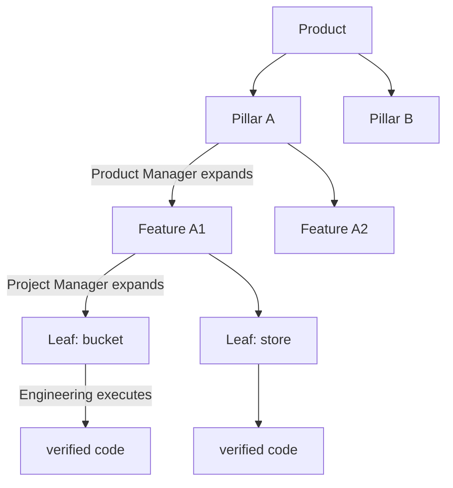
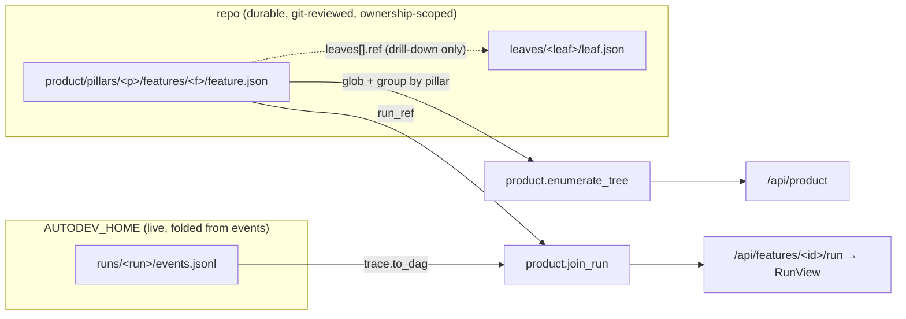
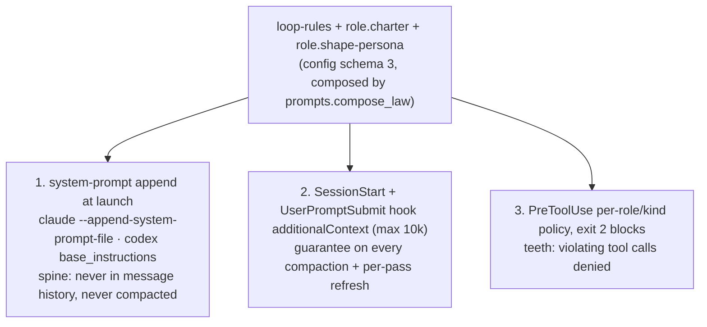

# Product Tree — Observability & Enforcement

**Status:** proposed · **Working brief:** `NEXT.md` (untracked, main checkout) · **Descriptor bump:** `2 → 3`
**Classification:** FEATURE (net-new subsystem; no existing behaviour is wrong) → this document is the gate.

This design adds a **UI-enumeration + observability + enforcement layer** on top of the working
execution runtime (worktrees, tmux, hooks, merge gate). It does **not** rewrite execution. Every
seam below is grounded in the code at `9bd02a7`; deviations from `NEXT.md` are called out inline.

---

## Problem

Today a managed project is a **flat list of agents** (`service.py:126` renders one table row per
`autodev.toml` agent) polled every 5 s (`service.py:134`). There is no product structure, no notion
of a role loop, and the only window into a live worker is the raw tmux pane / `logs/<agent>.log`
(`sessions.py:129-135`). Consequences an operator can observe now:

- Cannot see *what* is being built or *where each thread is* — only "agent X: running/offline".
- No durable role law: a worker's opening goal (`prompts.render_goal`, sent once via
  `sessions.send_goal:91-93`) is conversation history and is **summarised away on compaction**.
- No enforcement of role boundaries beyond coarse write-root ownership (`workspaces.ownership_violations:162`)
  which is checked *after the fact* at `status`/`merge`, never *blocking a tool call*.

Goal: make the product a **tree** (`Product → Pillar → Feature → Leaf`), make every role pass emit an
**append-only trace** folded deterministically into a per-agent DAG, and place each role's law where
compaction cannot erase it, backed by **blocking** PreToolUse policy.

---

## Data flow

### The product tree (durable intent) and who owns each level



Each node is an independent role-instance; many run at once at different depths. **"Not everything is
in the same phase" is structural, not special-cased** — there is no global phase.

### Enumeration ⋈ trace (how the UI knows what is happening)



- **Enumeration is one cheap glob** of small feature-grained files (`A1`). Leaves are linked, not
  inlined; run-state is joined only on drill-down (`A8`).
- Enumeration follows the existing ownership model unchanged: each node's JSON lives inside the owning
  role's `write_roots`, so sparse checkout + `ownership_violations` already scope who may write which
  level — the invariant "one file added to the managed repo, `autodev.toml`" (`config.py:13`,
  `workspaces.AUTOMATIC_CONTEXT:12-22`) holds because the tree is project intent authored by the role
  agents inside their write-roots, not Autodev scaffolding.

### Hook firehose → event → reducer → DAG (observability)

```mermaid
sequenceDiagram
  participant W as worker (codex/claude, tmux)
  participant H as hook cmd: autodev trace emit --run R
  participant J as events.jsonl (append-only)
  participant D as trace.to_dag (pure fold, Layer 1)
  participant G as gloss (Haiku on step_finished, Layer 2)
  participant U as dashboard
  W->>H: PreToolUse / PostToolUse / SubagentStart / Stop (JSON on stdin)
  H->>J: append one event line
  Note over J,D: replay is deterministic — same lines produce the same DAG
  J->>D: read lines
  D->>U: StageNode[] (stages from structure; other tools fold to tool_calls++)
  J-->>G: on step_finished only
  G-->>J: append step_finished.gloss (one bounded call, cached)
```

- **Layer 1 is rules, never a model** — stage is read from structure (`agent_type`, write path, verify
  cmd exit code); every other `PostToolUse` folds into `metrics.tool_calls++`. Pure fold ⇒ identical
  DAG every replay.
- **Layer 2 is Haiku, event-driven** (on `step_finished`), one bounded call per completed stage,
  cached in the event line. A live node needs no model call.

### Durable-law injection layers (survives compaction, backed by teeth)



Verified survival table (installed Claude Code 2.1.241 / Codex 0.147.0; see **Verified facts**):

| layer | survives compaction? | Claude flag | Codex flag |
|---|---|---|---|
| system-prompt append | yes — never in message history | `--append-system-prompt-file` | `base_instructions` (config key) |
| project instructions | yes — re-injected from disk | `CLAUDE.md` | `AGENTS.md` |
| SessionStart/UserPromptSubmit `additionalContext` | yes — re-fires per compaction/pass | hook JSON | hook JSON |
| opening goal / conversation history | no — summarised away | — | — |
| `PreCompact`/`PostCompact` injection | no — neither provider injects there | — | — |

---

## System design — where each piece lives and why

New modules (small public surface, one responsibility each):

| module | owns (one line) | composes |
|---|---|---|
| `trace.py` | event schema, append writer, pure reducer→DAG, token tail-reader, hook-config generator | `state.py` (paths) |
| `product.py` | tree schema + validator, enumerator, typed state-mutation actions, feature⋈trace join | `trace.py`, `state.py` |
| `orchestrator.py` | schedule role-instances across the tree, emit `phase_changed`, honour the approval gate | `product.py`, `trace.py`, `operations.py` |
| `policy.py` | pure per-role/kind PreToolUse decision (allow/deny + reason) | — (pure) |
| `gloss.py` | one-line Haiku gloss per completed stage via headless `claude -p` | `trace.py` |

Extended modules (wrap, do not rewrite):

- `config.py` — schema 3 parsing/validation (`LoopConfig`, `RoleConfig`, per-agent `pod`). The existing
  validators (`_table`, `_nonempty_string`, `_id`, `_roots`, `_string_list`, `config.py:68-133`) and
  fail-fast schema check (`config.py:227-228`) are the template; new tables reuse them.
- `templates.py` — emit the schema-3 tables. **Correction:** `render_full_descriptor` hardcodes
  `"schema_version = 2"` (`templates.py:43`) separately from `config.SCHEMA_VERSION` (`config.py:14`) —
  a latent duplication. B1 collapses this to a single source (`import config.SCHEMA_VERSION`).
- `prompts.py` — `render_goal` (`prompts.py:14`) becomes role/shape-aware; add `compose_law`.
- `providers.py` — `launch_command` (`providers.py:48`) gains hook-settings + system-prompt injection.
- `sessions.py` — `start_session` (`sessions.py:97`) exports run/role env into the tmux session.
- `state.py` — `ProjectPaths` (`state.py:27`) gains `runs`; add composed-law file path + atomic write
  (the atomic-replace pattern already exists at `state.py:55-67`).
- `workspaces.py` — `sparse_paths` (`workspaces.py:43`) gains role/kind-aware defaults.
- `service.py` — new read-only endpoints + light dashboard rewrite (`_dashboard`, `service.py:97`).
- `cli.py` — new verbs `trace emit`, `product`, `policy check`, `charter digest` (subparser pattern at
  `cli.py:166-234`, dispatch at `cli.py:237-378`).

Why these boundaries: the reducer is pure so replay is deterministic and testable without a runtime;
the policy is pure so it is testable with a fake hook payload; the orchestrator only *composes*
`operations.ensure_agents`/`start_session` (`operations.py:27`, `sessions.py:97`) — it never launches
tmux itself, so it can be tested with those swapped for fakes.

---

## Contracts (frozen first, so units parallelise)

### C-1 · Append-only event schema — `trace.py`

`AUTODEV_HOME/projects/<id>/runs/<run_id>/events.jsonl` (+ `artifacts/`). A **run = one agent's pass**,
scoped by `turn_id`. `feature.json.run_ref` points at `runs/<run_id>`.

| event | required fields |
|---|---|
| `run_started` | `run_id, role, node_ref{level,pillar,feature?,leaf?}, goal, ts` |
| `step_declared` | `step_id, parent, kind, objective, inputs[], expects, done_when, agent` |
| `step_started` | `step_id, agent, agent_type, provider, ts` |
| `artifact_written` | `step_id, artifact_id, path, sha, kind, meta{date?,relevance?,source?}` |
| `step_finished` | `step_id, status, output_artifacts[], tokens, gloss?` |
| `run_finished` | `status, output_artifact?, ts` |
| `phase_changed` | `node_ref, from, to, reason, ts` |

Every line also carries `seq` (monotonic int, for the `?since` cursor) and correlation keys
`turn_id, agent_id, agent_type, tool_use_id` when present. Edges derive from `inputs`. `kind` is one of
`{plan, search, contract, implement, integrate, reconcile, tool}`.

```python
# trace.py public surface
EVENT_TYPES: frozenset[str]
def new_event(kind: str, **fields) -> dict           # validates required fields, stamps seq+ts
def validate_event(obj: Mapping) -> dict             # raises TraceError on unknown/missing fields
def emit(run_dir: Path, event: Mapping) -> int       # append one line atomically, return seq
def read_events(run_dir: Path, *, since: int = 0) -> list[dict]
def to_dag(events: Iterable[Mapping]) -> RunView      # pure fold (Layer 1)
def hook_config(run_id: str, autodev_cmd: Sequence[str]) -> dict   # events -> verbs (A5a)
def read_tokens(transcript_path: Path, provider: str) -> int       # tail-reader (A11)
```

### C-2 · `feature.json` / `leaf.json` schema — `product.py`

**Correction to `NEXT §4`:** `NEXT` stores both `phase` *and* `loop`, but `phase` equals the role whose
`loop[].s == "active"` — storing it twice violates the ethos "derive, don't store, what can drift"
(§0.4). **Stored truth = `loop[]`; `phase` and `owner_role` are derived** in the API payload (`A8`),
never persisted. Add `approval` to implement the human gate (decision #4).

```jsonc
// feature.json — the enumeration unit (small, feature-grained)
{
  "id": "certified-l3-book",                 // ^[a-z][a-z0-9-]{0,31}$ (reuse config._ID_RE)
  "pillar": "replay-engine",                 // matches parent dir
  "name": "Certified L3 book",
  "approval": "approved",                    // "proposed" | "approved"  <- human control plane
  "loop": [                                  // stored checkpoints; advanced only on evidence
    {"role": "product-manager", "s": "done"},
    {"role": "project-manager", "s": "done"},
    {"role": "engineering",     "s": "active"}   // s in pending|active|done|blocked
  ],
  "run_ref": "runs/2026-08-24-book-7",       // nullable until first pass; relative to project home
  "leaves": [                                // links only — not inlined
    {"ref": "leaves/bucket/leaf.json", "id": "bucket"},
    {"ref": "leaves/store/leaf.json",  "id": "store"}
  ]
}
```

```jsonc
// leaf.json — followed on drill-down only
{ "id": "store", "feature": "certified-l3-book", "status": "in_progress",   // pending|in_progress|verified|blocked
  "pod": "book", "contract_ref": "contracts/rate_limit.pyi",
  "depends_on": ["bucket"], "run_ref": "runs/2026-08-24-book-7" }
```

Validation rules (fail-fast, mirroring `config.py`): unknown top-level keys **rejected**; `id`/`pillar`
match `_ID_RE`; `loop[].role` is a configured role; `s`/`status`/`approval` in their enums;
`leaves[].ref` is a relative POSIX path under the feature dir (reuse `config._root` semantics,
`config.py:113`); `depends_on` targets must be sibling leaf ids. An **"inbox" is a typed `depends_on`
edge with an unmet target**, never prose.

```python
# product.py public surface
def validate_feature(obj: Mapping, *, roles: Collection[str]) -> dict
def validate_leaf(obj: Mapping) -> dict
def enumerate_tree(project: ProjectConfig) -> ProductTree          # A1: glob + group by pillar
def load_leaf(project: ProjectConfig, feature_id: str, ref: str) -> dict
def join_run(project, feature: Mapping) -> FeatureView             # A8: derive phase + live sub-state
# typed state-mutation actions (decision #3) — schema-valid writes, atomic
def add_features(project, pillar: str, features: Sequence[Mapping]) -> list[Path]
def decompose_feature(project, feature_id: str, leaves: Sequence[Mapping]) -> list[Path]
def set_leaf_status(project, feature_id: str, leaf_id: str, status: str) -> Path
def set_run_ref(project, feature_id: str, run_id: str) -> Path
```

### C-3 · Reducer output — `RunView` / `StageNode` — `trace.py`

```python
@dataclass(frozen=True)
class StageNode:
    step_id: str
    kind: str  # plan|search|contract|implement|integrate|reconcile
    status: str  # declared|running|done|failed  (verify -> red|green)
    parent: str | None
    inputs: tuple[str, ...]  # -> edges (fan-in when len>1)
    agent: str | None
    agent_type: str | None
    tokens: int | None
    gloss: str | None
    artifacts: tuple[str, ...]


@dataclass(frozen=True)
class RunView:
    run_id: str
    role: str
    node_ref: dict
    status: str  # running|done|failed
    nodes: tuple[StageNode, ...]  # topologically ordered
    edges: tuple[tuple[str, str], ...]
    metrics: dict  # {"tool_calls": int, "tokens": int}
    active_step_id: str | None  # default-selected node in the UI
```

`FeatureView` (A8) = `feature.json` fields + derived `phase`/`owner_role` + embedded `RunView` when
`run_ref` is set.

### C-4 · Orchestrator / policy / gloss public surfaces

```python
# orchestrator.py
def tick(project: ProjectConfig, *, limits: LoopConfig) -> list[ScheduleDecision]
#   reads tree join trace, decides which nodes advance, starts role-instances via operations,
#   writes run_ref (product.set_run_ref) + phase_changed (trace.emit). Never edits pod source.

# policy.py  (pure — no I/O)
@dataclass(frozen=True)
class PolicyInput: role: str; kind: str; tool_name: str; tool_input: dict; write_roots: tuple[str,...]
@dataclass(frozen=True)
class PolicyDecision: allow: bool; reason: str
def decide(pi: PolicyInput) -> PolicyDecision

# gloss.py
def gloss_step(transcript_slice: str, *, claude_cmd: Sequence[str]) -> str   # headless claude -p --model haiku
```

Policy rules (from `NEXT §7.2`), each a row testable with a fake `PolicyInput`:

| role/kind | denied tool call |
|---|---|
| `search` | `Write` outside `artifacts/facts/**` |
| `contract` | `Write` to `src/impl/**` |
| `implement` | `Edit`/`Write` under `src/**` with no failing test recorded this pass (TDD gate) |
| `integrate` | (physical) `src/impl/**` absent via sparse checkout — `C5` |
| `project-manager` | `Edit`/`Write` to pod source |

---

## Descriptor schema 3 (`autodev.toml`) vs. the product tree

Kept separate: `autodev.toml` = **runtime config**; `product/pillars/**` = **product intent** authored
by role agents. Schema 3 is **additive** — `[loop]` and `[roles.*]` and agent `pod` are optional with
defaults, so a schema-3 descriptor with none of them still loads. Only `schema_version` is forced to 3
(fail-fast on 2, matching the 1->2 precedent in `README.md:325-327`).

```toml
schema_version = 3

[loop]
sequence = ["project-manager", "engineering", "project-manager"]
reenter_product_manager_when = ["new-requirement", "queues-exhausted", "roadmap-contradiction"]
max_concurrent = 4                       # orchestrator concurrency limit

[roles.product-manager]
shape = "research"                       # research | contract-first | reconcile
charter = "Own a Pillar. Extract facts {claim,source,date,relevance}; rank recency x relevance; emit the Pillar's Features."

[roles.project-manager]
shape = "reconcile"
charter = "Own a Feature. Split into complete leaves; emit depends_on edges; never approve a leaf whose gate needs unmerged work."

[roles.engineering]
shape = "contract-first"
charter = "Own a Leaf. Interfaces + red tests before internals; unit against its contract slice only; integration reads eval signals, not source."

[[agents]]
id = "book"
provider = "claude"
pod = "book"                             # NEW: groups agents into a pod for role assignment
purpose = "..."
goal = "..."
write_roots = ["src/impl/book/", "product/pillars/replay-engine/features/certified-l3-book/"]
read_roots = ["contracts/"]
```

Validation rules grounded in `config.py`:

- `[loop].sequence`, `reenter_product_manager_when` use `_string_list` (`config.py:98`); every
  `sequence` entry must be a key in `[roles.*]`. `max_concurrent` is a positive int (new
  `_positive_int`, patterned on `_ui_port`, `config.py:86`).
- `[roles.<id>]` uses `_id` for the id (`config.py:106`); `shape` in `{research, contract-first,
  reconcile}`; `charter` via `_nonempty_string`. New frozen dataclasses `LoopConfig`, `RoleConfig`;
  `ProjectConfig` gains `loop: LoopConfig | None`, `roles: dict[str, RoleConfig]`.
- `AgentConfig` (`config.py:34`) gains `pod: str | None` (via `_id` when present).
- **No new provider/agent fallback paths** — one canonical parse, fail-fast (`CLAUDE.md`: one
  implementation).

---

## Units of work

Format: `in -> out -> unit test -> integration test -> the one module`. Ordered by dependency; each
leaves the repo green. **Re-decompositions from `NEXT §10` are marked (RD) and explained in the next
section.** New tests extend `tests/test_<module>.py`; integration tests reuse the `project_repo`
fixture (`tests/conftest.py`) plus a new `product_tree` fixture.

### Phase 0 — freeze contracts

- **U0** event dataclasses + `new_event`/`validate_event` -> a validated dict; unknown/missing field
  raises `TraceError` · in: kwargs -> out: dict with `seq`,`ts` · unit: valid line round-trips, unknown
  key rejected · int: a hand-written `events.jsonl` fixture loads via `read_events` · **`trace.py`**.
- **U0b** `validate_feature`/`validate_leaf` -> schema-valid dict · in: dict + role set -> out:
  normalised dict · unit: valid/invalid fixtures, unknown top-level key rejected, bad `depends_on`
  rejected · int: a seeded `product/` tree validates end to end · **`product.py`**.

### Phase A — enumeration & trace

- **A1 (RD)** enumerator: glob `product/pillars/*/features/*/feature.json`, group by pillar, resolve
  `leaves[].ref` lazily · in: seeded repo -> out: `ProductTree` · unit: tree fixture -> grouped model,
  missing/duplicate ref fails fast · int: `enumerate_tree(load_project(repo))` on the `product_tree`
  fixture · **`product.py`** *(dropped `service.py`; HTTP exposure is A9).*
- **A2** `emit(run_dir, event)` append writer · in: event -> out: appended line + returned `seq` · unit:
  two emits yield seq 1,2 and two lines · int: emit then `read_events` round-trips · **`trace.py`**.
- **A3** `to_dag(events)` reducer · in: event list -> out: `RunView` with fan-out/fan-in edges and
  `tool_calls` fold · unit: crafted stream -> expected nodes/edges; non-stage `PostToolUse` ->
  `tool_calls++` only; replay twice = identical · int: a real PM + Eng `events.jsonl` fold shows visible
  fan-out and fan-in · **`trace.py`**.
- **A4** `runs` on `ProjectPaths` · in: project id -> out: `.../runs` path · unit: `project_paths(id).runs`
  equals home/runs · int: `emit` writes under it · **`state.py`**.
- **A5a (RD)** `hook_config(run_id, autodev_cmd)` -> provider-agnostic hook spec (events -> `autodev
  trace emit` / `charter digest` / `policy check`) · in: run id -> out: dict keyed by event name · unit:
  dict has PreToolUse/PostToolUse/SubagentStart/Stop/SessionStart/UserPromptSubmit -> correct verbs ·
  int: spec renders under both providers in A5b · **`trace.py`** *(split out of NEXT A5).*
- **A5b (RD)** `launch_command(..., hook_config=None)` renders the spec: Claude `--settings '<json>'`,
  Codex `-c hooks...` + `--dangerously-bypass-hook-trust` · in: provider+spec -> out: argv · unit: argv
  contains the rendered injection per provider · int: fake CLI launches with the flags present ·
  **`providers.py`** *(NEXT paired this with workspaces.py; injection is argv-only, so no worktree file,
  preserving the one-file invariant).*
- **A5c (RD, NEW)** session env export: `start_session` prepends `tmux new-session -e AUTODEV_RUN_ID=…
  -e AUTODEV_ROLE=… -e AUTODEV_KIND=…` so hook verbs resolve their run · in: agent+run -> out: session
  env · unit: assembled tmux argv carries the `-e` pairs · int: existing tmux test asserts a hook verb
  reads `AUTODEV_RUN_ID` · **`sessions.py`** *(load-bearing plumbing absent from NEXT §10).*
- **A6** `autodev trace emit --run <id>` reads hook JSON on stdin, calls `trace.emit` · in: stdin JSON
  -> out: appended event · unit: piped fixture appends one event · int: CLI invocation writes the line ·
  **`cli.py`** (depends on `trace.py`).
- **A7** `gloss_step` on `step_finished` via headless `claude -p --model <haiku>` over a transcript
  slice · in: slice -> out: one-line gloss · unit: fake `claude` executable returns canned text; called
  once per completed stage, cached · int: fold + gloss annotates a completed node · **`gloss.py`**.
- **A8** `join_run(project, feature)` -> `FeatureView` with **derived** phase/owner_role + embedded
  `RunView` · in: feature + run_ref -> out: view · unit: loop `[done,done,active]` -> phase engineering;
  no run_ref -> phase from loop only · int: seeded feature + `events.jsonl` -> phase + live sub-state ·
  **`product.py`**.
- **A9** endpoints `GET /api/product`, `/api/features/<id>/run`, `/api/leaves/<id>`, `?since=<seq>` ·
  in: HTTP GET -> out: JSON · unit: handler returns enumerated tree / RunView · int: threaded server
  (pattern at `tests/test_service.py:16-29`) returns tree with per-feature phases · **`service.py`**.
- **A10** dashboard: Pillars->Features, per-feature loop strip + own phase, metrics, drill to run DAG
  (default = active node), read-only leaves + unmet `depends_on`; light palette (`#f6f7f9` ground,
  white cards, capitalised badges) · in: page load -> out: HTML/JS from `/api/*` · unit: `_dashboard`
  HTML contains the loop-strip + product markers · int: server serves the page, no Markdown scraping ·
  **`service.py`**.
- **A11** `read_tokens(transcript_path, provider)` tail-reader · in: transcript tail -> out: int tokens ·
  unit: per-provider fixture -> count · int: `step_finished.tokens` populated on fold · **`trace.py`**.

### Phase B — roles & loop

- **B1 (RD)** schema 3: parse/validate `LoopConfig`, `RoleConfig`, agent `pod`; `SCHEMA_VERSION=3`;
  `templates` imports `config.SCHEMA_VERSION` (collapse the `templates.py:43` duplication) · in:
  schema-3 TOML -> out: `ProjectConfig` · unit: valid schema 3 loads; schema 2 fails fast; bad `shape`
  rejected; `sequence` entry with no role rejected · int: `load_project` on a schema-3 fixture ·
  **`config.py`** (+ 1-line `templates.py` version source).
- **B1b (RD)** `render_full_descriptor` emits `[loop]`, `[roles.*]`, agent `pod` when provided · in:
  config args -> out: TOML that `load_project` accepts as schema 3 · unit: round-trip render->load ·
  int: `product_tree` fixture emits schema 3 · **`templates.py`** *(emitter split from the parser).*
- **B2** `compose_law(loop, role)` + role/shape-aware `render_goal` · in: `RoleConfig`+`LoopConfig` ->
  out: composed law string / shaped goal · unit: research shape emits fan-in framing; contract-first
  emits red-tests-first · int: `render_goal` for an engineering agent includes its charter ·
  **`prompts.py`**.
- **B3** Orchestrator `tick`: schedule role-instances under `max_concurrent`, advance a node on
  evidence, emit `phase_changed`, refuse to schedule a `proposed` feature · in: tree join trace -> out:
  `ScheduleDecision[]` + `phase_changed` · unit: node advances PM->PjM->Eng on trace evidence; a
  `proposed` feature is not scheduled · int: a Pillar expands to Features then Leaves with fakes for
  `operations.ensure_agents` · **`orchestrator.py`**.
- **B4** typed actions `add_features`/`decompose_feature`/`set_leaf_status`/`set_run_ref` writing
  schema-valid JSON atomically · in: action + payload -> out: written file · unit: `add_features`
  writes a valid `feature.json`; invalid payload raises before writing · int: decompose then enumerate
  shows the new leaves · **`product.py`**.

### Phase C — durable behaviour & enforcement

- **C1 (RD)** composed-law file under `AUTODEV_HOME` (path on `ProjectPaths` + atomic write/read,
  reusing `state.py:55-67`) · in: law string -> out: persisted file · unit: write then read
  round-trips, mode 0600 · int: file created outside the worktree (no ownership-check collision) ·
  **`state.py`** *(content comes from B2; NEXT paired with prompts.py — content vs. persistence split).*
- **C2** launch flags: Claude `--append-system-prompt-file <lawfile>`, Codex `base_instructions` from
  the law file · in: provider + law path -> out: argv · unit: argv per provider carries the flag · int:
  fake CLI launches with it · **`providers.py`**.
- **C3 (RD)** `autodev charter digest --run <id>` prints `hookSpecificOutput.additionalContext` (<=10k)
  from the composed law; A5a registers it on SessionStart+UserPromptSubmit · in: run id -> out: JSON on
  stdout · unit: emits valid additionalContext JSON · int: hook spec routes the two events to it ·
  **`cli.py`** *(cli verb only; hook wiring lives in A5a).*
- **C4** `policy.decide(PolicyInput)` per-role/kind (§7.2 table) · in: `PolicyInput` -> out:
  `PolicyDecision` · unit: each rule row — search Write outside facts denied; contract Write to
  `src/impl/**` denied; implement Write `src/**` with no red test denied; allow otherwise · int: N/A
  (pure) · **`policy.py`**.
- **C4b (RD)** `autodev policy check --run <id>` reads hook JSON on stdin, resolves role/kind from env
  (A5c), calls `policy.decide`, **exits 2 with reason on stdout** to block (verified block contract);
  A5a registers it on PreToolUse · in: stdin hook JSON -> out: exit code 0/2 · unit: denied input ->
  exit 2 + reason; allowed -> exit 0 · int: an `implement` worker's `Write src/**` before a red test is
  blocked · **`cli.py`** *(verb wiring split from the pure decision).*
- **C5** role/kind->sparse-root defaults so `integrate` excludes `src/impl/**` · in: agent+role/kind ->
  out: sparse patterns · unit: integrate role's `sparse_paths` omits `src/impl/**` · int: worktree for
  an integrator has no `src/impl/**` on disk · **`workspaces.py`**.

**Dependency order:** `U0/U0b -> A1 || A2/A3/A4 -> A5a/A5b/A5c/A6 || B1/B1b/B2 -> A7/A8/A11 -> B3/B4 ->
C1/C2/C3/C4/C4b/C5 -> A9/A10`.

---

## Re-decompositions I made to `NEXT §10` (and why)

Each change keeps every unit to **one module** and testable with its collaborators faked.

1. **A1 -> `product.py` only** (NEXT: `product.py + service.py`). Enumeration is a pure glob/group; HTTP
   exposure is already A9. Two modules => split; A1 owns the tree, A9 owns the endpoint.
2. **A5 -> A5a (trace.py) + A5b (providers.py) + A5c (sessions.py)** (NEXT: `providers.py
   (+workspaces.py)`). The hook *content* needs the event contract (trace.py); *rendering to argv* is
   provider-specific (providers.py); the *run/role binding* the hooks read at runtime must be in the
   session env (sessions.py) — this last piece was missing from NEXT and is load-bearing for
   A6/C3/C4b. Injection is argv/`--settings`-only, so **no hook file lands in the managed repo** — the
   one-file invariant holds, removing the `workspaces.py` touch NEXT anticipated.
3. **C1 -> `state.py` only** (NEXT: `state.py + prompts.py`). Content is produced by B2
   (`prompts.compose_law`); C1 only persists it. Depend on the seam, do not co-edit.
4. **C3 -> `cli.py` only** (NEXT: `providers.py + cli.py`). The verb is cli.py; the hook registration is
   data in A5a's spec, not a providers.py edit.
5. **C4 -> C4 (policy.py, pure decision) + C4b (cli.py, verb+exit-code+registration)** (NEXT: single
   `policy.py`). The pure decision and the stdin/exit-2 wiring are different modules; splitting keeps the
   decision table unit-testable without a subprocess.
6. **B1 -> B1 (config.py parser) + B1b (templates.py emitter)** (NEXT: single `config.py`). Bumping
   `SCHEMA_VERSION` breaks the shared `render_full_descriptor` unless the emitter moves in lockstep;
   making them separate units (parser first, emitter second, both additive) keeps the suite green at
   each step and fixes the `templates.py:43` version duplication.

Schema correction (C-2): dropped stored `phase`/`owner_role` from `feature.json` in favour of deriving
them from `loop[]` (ethos §0.4), and added `approval` to carry the human gate.

---

## Product decisions — recommendations (need operator sign-off)

### Decision #3 — who authors `feature.json`/`leaf.json`?

**Recommendation: typed writes by the owning role, through an `autodev product` CLI verb that validates
against the C-2 schema and writes atomically (B4) — the same contract pattern as `autodev trace emit`.
Not provider structured-output, not a derived projection.**

- A **derived projection** cannot work: the tree *structure* (which Features/Leaves exist,
  `depends_on` edges) is **intent that does not exist until a role decides it** — there is nothing in a
  trace to project it from. What *is* derived is phase/live sub-state (A8), consistent with §0.4.
- **Provider structured-output** (Codex `exec --output-schema`, verified present at 0.147.0) only
  applies to non-interactive `codex exec`; workers run **interactive in tmux** (`sessions.py:116`),
  where it does not apply, and Claude's interactive CLI has no equivalent. Coupling authorship to it
  would fork behaviour by provider — against "one canonical implementation".
- A **CLI verb** is provider-agnostic (both providers already shell out to `autodev` via the operator
  skill), schema-validates at the boundary (fail-fast like `config.py`), and composes with the existing
  runtime with **zero change to how execution works**. Ownership already scopes *where* a role may
  write (`workspaces`); the schema scopes *shape*; PreToolUse (C4) blocks free-form `Write` to the
  tree path so the verb is the only sanctioned mutation path.

Sign-off needed on: the verb surface (`add_features`/`decompose_feature`/`set_leaf_status`) and that
routing all tree mutations through it (blocking raw edits) is acceptable ergonomics for the role agents.

### Decision #4 — orchestrator autonomy vs. human gate (esp. PM re-entry)

**Recommendation: autonomous *within* an approved Feature; human-gated at *intent boundaries*. This
maps exactly onto the operator's own BUG/FEATURE law (`CLAUDE.md` Delegation).**

- **Unattended:** everything downstream of an `approval:"approved"` Feature — PjM decompose -> Eng
  build -> PjM reconcile, across the tree under `[loop].max_concurrent`. This is executing
  already-approved intent (BUG-like); no gate, matching the existing autonomous worker loop.
- **Human gate:** (a) Product-Manager expansion of a Pillar emits Features as `approval:"proposed"`;
  the orchestrator (B3) **will not schedule** PjM/Eng on a proposed Feature until a human flips it to
  `approved` via the dashboard/CLI. (b) PM **re-entry** triggers (`reenter_product_manager_when`) raise
  a proposal, never auto-restructure a live tree. This is net-new intent (FEATURE-like) -> gated.
- The gate lives in one place — `orchestrator.tick` reads `approval` — so autonomy is a **data** state
  on the node, not scattered logic. "The tree is the human control plane" (§0.7) becomes literal:
  approve/reprioritise nodes, do not babysit transcripts.

Sign-off needed on: whether Pillar->Feature expansion should gate (recommended) or run fully
autonomous, and whether Eng->PjM reconcile should ever gate (recommended: no).

---

## Empirical checks to run BEFORE implementation

Both need a live provider session (an authenticated account), so they are **not run in this spike** —
Autodev never embeds a runtime and the operator's account should not be spent here. Each has an exact
procedure and gates a specific unit.

### E-1 — Does `--append-system-prompt` survive mid-session compaction? (gates C2)

`NEXT §12` verifies the *flag exists* and that the system prompt is *not in message history*; it does
**not** prove the appended text is re-sent after Claude's auto-compaction. Procedure (~20 min):

1. Launch `claude --append-system-prompt "CANARY-LAW: always prefix replies with [LAW]." --model <default>`
   in a scratch dir (no repo side effects).
2. Drive a long conversation to force auto-compaction (or trigger `/compact`); confirm compaction
   occurred (context indicator / `--include-hook-events` PreCompact).
3. After compaction, send a trivial prompt. **Pass** = reply still prefixed `[LAW]`.
4. Repeat for Codex with `base_instructions`.

- **Pass** => system-prompt append is the durable spine (C2 as designed).
- **Fail** => demote the spine to the SessionStart/UserPromptSubmit `additionalContext` layer (C3
  already re-fires per compaction — verified contract) and C2 becomes best-effort. **Gate: C2's status
  (spine vs best-effort) is decided by E-1.**

### E-2 — Do blocking PreToolUse hooks fire under `bypass_permissions = true`? (gates C4b)

Verified block contract (Claude docs, this spike): PreToolUse blocks on **exit 2** (stderr = reason)
or `hookSpecificOutput.permissionDecision:"deny"`. Unknown: whether `--dangerously-skip-permissions`
(passed when `bypass_permissions=true`, `providers.py:72`) short-circuits the PreToolUse pipeline.
Procedure (~15 min, scratch dir):

1. Write `settings.json` with a PreToolUse hook on `matcher:"Write|Edit"` whose command `exit 2`s with
   a reason.
2. `claude --dangerously-skip-permissions --settings ./settings.json -p "create a file foo.txt"`.
3. **Pass** = the Write is blocked and the reason surfaces.
4. Repeat for Codex: hook + `--dangerously-bypass-approvals-and-sandbox` + `--dangerously-bypass-hook-trust`
   (Autodev-generated hooks are untrusted, so this flag is required for them to fire — a fact **not in
   NEXT** and load-bearing for A5b).

- **Pass** => C4b enforced under bypass as designed.
- **Fail** => the teeth have a hole when unattended; either (i) do not permit `bypass_permissions=true`
  with roles that require blocking policy (fail-fast in `config.py` B1), or (ii) fall back to physical
  enforcement only (C5 sparse exclusion) for the affected rules. **Gate: C4b's guarantee and a possible
  B1 config constraint are decided by E-2.**

---

## Verified facts (installed versions; do not re-derive)

- **Claude Code 2.1.241** exposes `--append-system-prompt` / `--append-system-prompt-file`,
  `--system-prompt[-file]`, `--settings <file-or-json>` (accepts a JSON string, so hooks inject without
  a repo file), `-p/--print --model --output-format` (headless, for gloss). Hooks `settings.json`
  shape: `{"hooks":{"<Event>":[{"matcher":"Write|Edit","hooks":[{"type":"command","command":"..."}]}]}}`.
  PreToolUse blocks on **exit 2** (stderr = reason) or exit 0 +
  `hookSpecificOutput.permissionDecision:"deny"` + `permissionDecisionReason`; exit 2 is the portable
  hard block. SessionStart/UserPromptSubmit add context via
  `hookSpecificOutput.additionalContext` (or plain stdout). (Source: `code.claude.com/docs/en/hooks.md`,
  fetched this spike.)
- **Codex CLI 0.147.0** exposes `exec --output-schema <FILE>` + `exec --json` (structured output, for
  reference), `-c key=value` config overrides, `--profile <name>` (layers
  `$CODEX_HOME/<name>.config.toml`), `--dangerously-bypass-hook-trust`,
  `--dangerously-bypass-approvals-and-sandbox`. `base_instructions` is cited by `NEXT §12` but is **not
  visible in `--help`** — flag to confirm the exact key before C2.
- **tmux 3.7b** supports `new-session -e KEY=VALUE` for per-session env (A5c).
- No `hook`/`trace`/`product` code exists in `src/` or `tests/` today (`rg` clean) — greenfield for the
  new modules.

---

## Rejected alternatives

- **Markdown/tmux as source of truth (regex intent out of prose)** — the core anti-pattern; forecloses
  deterministic enumeration and reproducible DAGs. State is JSON; prose is rendered from it.
- **Pillar-level enumeration blob / single `project.json`** — too coarse (imports noise) or a merge
  hotspot. Feature-grained files that link to leaves; enumeration is one glob.
- **Storing `phase` in `feature.json`** — drifts from `loop[]`; derive it (§0.4).
- **Organising the UI by role** — the product tree (Pillars->Features) is the axis; role is per-node.
- **A global loop phase** — phase is per-node; many run at once.
- **Haiku on an interval / a model to build the DAG** — the reducer is a pure fold; Haiku is
  event-driven and bounded (one call per completed stage).
- **Provider structured-output for tree authorship** — interactive-session mismatch + forks behaviour
  per provider (decision #3).
- **Novel `CHARTER.md` / `PostCompact` re-injection** — not durable; neither provider injects at
  PostCompact (§12). Use system-prompt append + SessionStart/UserPromptSubmit + teeth.
- **Hook config file inside the managed repo** — would break the one-file invariant; inject via
  `--settings`/`-c` argv instead.
- **A separate observability UI** — extend the existing per-project dashboard/API.
- **Rewriting the execution runtime** — this layer is strictly additive.

---

## Risks & open questions

**Needs a human decision (top priority):**

- **Decision #3** (tree authorship) and **Decision #4** (autonomy vs. gate) above — recommendations
  given; both need operator sign-off before B3/B4/C4b are built.
- **E-1 / E-2 outcomes** change the shape of C2 and C4b respectively (see procedures). Run these first.

**Technical risks:**

- **Codex hook config schema** — `NEXT §12` asserts event-name parity, but I could not extract Codex's
  `config.toml` hooks table shape or its `additionalContext` field name from `codex --help` (0.147.0).
  **Verify against current Codex docs before A5b/C3/C4b**; the design assumes `-c hooks...` overrides +
  `--dangerously-bypass-hook-trust`. If Codex hooks cannot be injected via `-c` cleanly, fall back to a
  generated `$CODEX_HOME/<profile>.config.toml` + `codex --profile autodev` (the profile-layering flag
  is verified present) + `CODEX_HOME` env from A5c.
- **Codex `base_instructions` key name** — cited in §12; not visible in `--help`. Confirm before C2.
- **A11 token tail-reader is per-provider** (§13.5) — Claude and Codex transcript formats differ;
  A11 needs one parser each, behind `read_tokens(..., provider)`. No token field is in any hook payload
  (§12), so this is the only token source.
- **Gloss cost/latency** — one headless `claude -p` per completed stage; cache in `step_finished.gloss`
  and never call for live nodes (A7). Bounded, but adds a Claude dependency for Codex-only projects;
  acceptable since gloss is presentation-only and degrades to "no gloss" if `claude` is absent.
- **`?since` cursor correctness** — relies on the monotonic `seq` in every event (C-1); the append
  writer (A2) assigns `seq` under the same file, single-writer per run (one pass = one writer), so no
  locking is needed.

---

## Done when (GOAL)

```
/goal Build the product-tree observability layer per docs/design/product-tree-observability.md, one
unit at a time, committing per unit and keeping the suite green. DONE WHEN every clause holds, each
shown by the named command's output in the transcript:

1. `uv run pytest -q` exits 0 with new tests present in tests/test_trace.py, tests/test_product.py,
   tests/test_config.py, tests/test_prompts.py, tests/test_orchestrator.py, tests/test_providers.py,
   tests/test_policy.py, tests/test_gloss.py, tests/test_workspaces.py, tests/test_service.py,
   tests/test_sessions.py, tests/test_templates.py.
2. `uv run ruff check .` and `uv run ruff format --check .` both exit 0.
3. `rg -n "schema_version" src/autodev/config.py src/autodev/templates.py` shows version 3 sourced
   from config.SCHEMA_VERSION in both (no separate literal in templates.py).
4. `rg -n "def to_dag|def emit|def hook_config|def read_tokens" src/autodev/trace.py` and
   `rg -n "def enumerate_tree|def join_run|def add_features|def decompose_feature|def validate_feature"
   src/autodev/product.py` and `rg -n "def decide" src/autodev/policy.py` and
   `rg -n "def tick" src/autodev/orchestrator.py` and `rg -n "def gloss_step" src/autodev/gloss.py`
   each return matches.
5. A pytest integration test shows the Orchestrator expanding a Pillar into Features and a Feature into
   Leaves, writing schema-valid feature.json/leaf.json and emitting a phase_changed event; assert its
   name via `rg -n "phase_changed|expands|decompose" tests/test_orchestrator.py`.
6. A pytest test builds the dashboard by globbing feature.json (no Markdown scraping): assert via
   `rg -n "enumerate_tree|feature.json|loop" tests/test_service.py`.
7. A pytest test folds a Product-Manager events.jsonl and an Engineering events.jsonl into a RunView
   with visible fan-out and fan-in edges; assert via `rg -n "fan|edges|to_dag" tests/test_trace.py`.
8. A pytest test for GET /api/features/<id>/run returns a RunView with per-node status, tokens, and
   gloss, defaulting active_step_id to the running node, with leaves + unmet depends_on readable.
9. A pytest test shows an `implement` worker's Write to src/** before a red test is blocked
   (policy.decide -> allow=False; `autodev policy check` exits 2).
10. A pytest test shows the composed role charter still present after a forced-compaction fixture
    (SessionStart additionalContext path), independent of E-1's outcome.

Constraints: no file outside src/autodev/, tests/, and docs/ is modified; the managed-repo one-file
invariant holds (hook/law injection only via --settings/-c in src/autodev/providers.py, no file written
into a worktree); one canonical path per module, no fallback modes. Run E-1 and E-2 before C2 and C4b
and record results in the PR. Stop after 160 turns.
```
